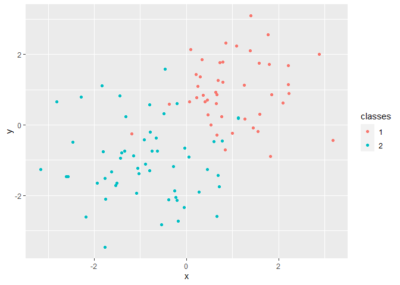
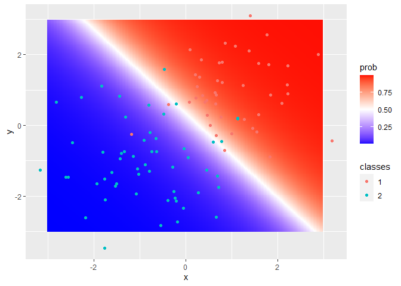
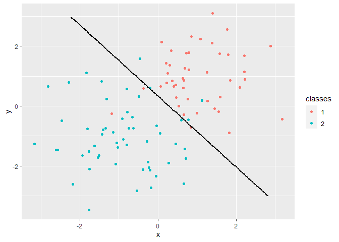
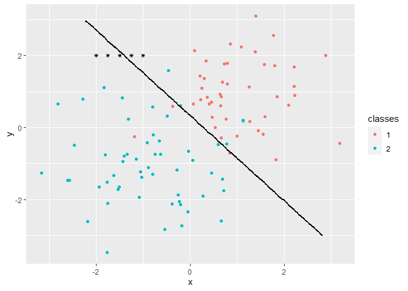
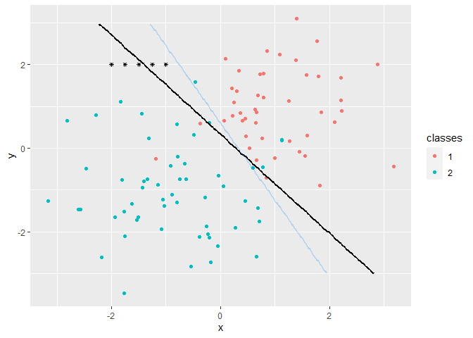

Adversarial 1: Poisoning attack
================
Jose Giner

To concretely illustrate poisoning attacks, let’s demonstrate exactly
how the decision boundary of a simple machine learning classifier can be
manipulated by an attacker with unbounded query access to system
predictions.

## EXERCISE:

1.  Build an artificial set of labelled samples with two input features
    (x, y) and two classes. The number of samples will be 200 and we
    will use 100 for training and 100 for test.

2.  Build a neural network model to predict the classes based on the x
    and y features.

3.  Compute the **confusion matrix** of the training and the test sets.
    **What conclusions can you extract?**

4.- Draw a scatter plot with the training points and one color per
class.

5.- Build a mesh of points dense enough to cover the space of almost all
the samples. Build a dataframe from these points with feature columns x
and y.

6.- Apply the model prediction to the point mesh build in step 5.

7.- Add the predictions as a column of the dataframe built in step 5.

``` r
library(mlbench)
library(caret)
library(dplyr)
library(plotly)
library(ggplot2)

set.seed(101)

p <- mlbench.2dnormals(n=200, cl=2)
pdf <- as.data.frame(p)
names(pdf) <- c("x","y", "classes")

index = sample(1:nrow(pdf), size = 100)

train_obs = pdf[-index,]
test_obs = pdf[index,]

train_params <- trainControl(method = "repeatedcv", number = 10)

nnet_model <- train(train_obs[,-3], train_obs$classes,
                 method = "nnet",
                 trControl= train_params, trace = FALSE)

pred_tr <- predict(nnet_model, train_obs)
pred_te <- predict(nnet_model, test_obs)


confusionMatrix(pred_tr, train_obs$classes)
```

    ## Confusion Matrix and Statistics
    ## 
    ##           Reference
    ## Prediction  1  2
    ##          1 42  5
    ##          2  3 50
    ##                                           
    ##                Accuracy : 0.92            
    ##                  95% CI : (0.8484, 0.9648)
    ##     No Information Rate : 0.55            
    ##     P-Value [Acc > NIR] : 4.532e-16       
    ##                                           
    ##                   Kappa : 0.839           
    ##                                           
    ##  Mcnemar's Test P-Value : 0.7237          
    ##                                           
    ##             Sensitivity : 0.9333          
    ##             Specificity : 0.9091          
    ##          Pos Pred Value : 0.8936          
    ##          Neg Pred Value : 0.9434          
    ##              Prevalence : 0.4500          
    ##          Detection Rate : 0.4200          
    ##    Detection Prevalence : 0.4700          
    ##       Balanced Accuracy : 0.9212          
    ##                                           
    ##        'Positive' Class : 1               
    ## 

``` r
confusionMatrix(pred_te, test_obs$classes)
```

    ## Confusion Matrix and Statistics
    ## 
    ##           Reference
    ## Prediction  1  2
    ##          1 46  1
    ##          2  8 45
    ##                                         
    ##                Accuracy : 0.91          
    ##                  95% CI : (0.836, 0.958)
    ##     No Information Rate : 0.54          
    ##     P-Value [Acc > NIR] : 8.791e-16     
    ##                                         
    ##                   Kappa : 0.8209        
    ##                                         
    ##  Mcnemar's Test P-Value : 0.0455        
    ##                                         
    ##             Sensitivity : 0.8519        
    ##             Specificity : 0.9783        
    ##          Pos Pred Value : 0.9787        
    ##          Neg Pred Value : 0.8491        
    ##              Prevalence : 0.5400        
    ##          Detection Rate : 0.4600        
    ##    Detection Prevalence : 0.4700        
    ##       Balanced Accuracy : 0.9151        
    ##                                         
    ##        'Positive' Class : 1             
    ## 

``` r
p1 = geom_point(data = train_obs, aes(x = x, y = y, color = classes))
train_obs %>% ggplot() + p1
```

<!-- --> From
predictions in both training and test set, we can see that the neural
network obtains similar accuracies although train accuracy is higher
than test one. In the test set, more class 1 observations are wrongly
classified than in the training set, and this can be seen in the
sensitivity and negative predicted values. From the Kappa statistic, we
can see similar and acceptable agreement rates.

``` r
df1 = data_frame()
```

    ## Warning: `data_frame()` is deprecated as of tibble 1.1.0.
    ## Please use `tibble()` instead.
    ## This warning is displayed once every 8 hours.
    ## Call `lifecycle::last_warnings()` to see where this warning was generated.

``` r
for (x in seq(-3, 3,by = (max(train_obs$x)- min(train_obs$x))/200)){
  for (y in seq(-3, 3, by = (max(train_obs$y)- min(train_obs$y))/200)){
    df2 = data_frame('x' = x, 'y'= y)
    df1 = rbind(df1,df2)
    
  }
}  

pred_mesh <- predict(nnet_model, df1, type = "prob")
df1$prob = pred_mesh[,1]
```

## EXERCISE (part 1):

1.  Plot a new graph from the grid of points obtained in step 7 of the
    previous exercise. We will use a ggplot() assigning the grid of
    points to the parameter data and the esthetics x=x and y=y.

2.  We will add a layer of geom\_tile() assigning the probability of
    each grid point to the parameter fill.

3.  Add a layer with the scatter plot built in step 4 of the previous
    exercise.

4.  Visualize it.

Can you see the decission boundary? Where is it?

``` r
library(scales)
```

    ## Warning: package 'scales' was built under R version 4.0.3

``` r
p2 = ggplot() + geom_tile(data = df1, aes(x = x , y = y, fill = prob)) +  scale_fill_gradient2(high = "red",mid = "white",low = "blue", midpoint = 0.5) + p1 
p2 
```

<!-- --> The
decision boundary can be clearly appreciated by a straight white line
crossing the point grid, and it is separating the areas or points where
predicted probability (in this case probability of belonging to class 1)
by the model is less than 0.50 and greater than 0.50. In other words,
this boundary will let us know the predicted class label of an
observation based in the side it falls into. So through the training set
represented at the scatter plot, we can see that few points are going to
be incorrectly classified, corresponding with the FP and FN values we
saw at the confusion matrix.

## EXERCISE (part 2):

1.  Filter the points in the grid to obtain only the ones whose
    probability is between 0.49 and 0.51 (included). This will be the
    decision boundary at 0.5.

2.  Draw the plot built in the step 4 of the first exercise and add a
    layer geom\_line() in black with the list of points obtained in the
    previous step.

<!-- end list -->

``` r
df3 = df1 %>% filter(prob >= 0.49 & prob <= 0.51)
p3 = ggplot() + p1 + geom_line(data = df3, aes(x = x, y = y), size = 1)
p3
```

<!-- -->

## EXERCISE (the Poisoning points):

Generate five carefully selected chaff points (5% of the training
dataset) near the decision boundary. Assign the label that you want to
be affected to these points to move the boundary in the desired
direction.

Visualize the plot built in the part 2 of the previous exercise with
this “Poisoning points”.

``` r
poison <-data.frame(
        t(data.frame(c(-2,2,2),c(-1.75,2,2),c(-1.5,2,2), c(-1.25,2,2), c(-1,2,2)))
        ,row.names = NULL)

colnames(poison) = c("x", "y", "classes")
poison$classes = factor(poison$classes)
glimpse(poison)
```

    ## Rows: 5
    ## Columns: 3
    ## $ x       <dbl> -2.00, -1.75, -1.50, -1.25, -1.00
    ## $ y       <dbl> 2, 2, 2, 2, 2
    ## $ classes <fct> 2, 2, 2, 2, 2

``` r
p4 = p3 + geom_point(data = poison, aes(x = x, y = y), shape = 8, size = 1)
p4
```

<!-- -->

## EXERCISE (the Poisoning attack):

1.  Add the Poisoning points to the training points to build a Poisoning
    training set.

2.  Train a new model with the Poisoning training set (to simulate the
    result of a Poisoning attack).

3.  Calculate the confusion matrix of the Poisoning training set and the
    original test set using the Poisoning model.

4.  Plot the scatter plot built in the previous exercise adding a layer
    with the new decision boundary.

Can you see any difference? What conclusions can you extract?

Check again the confusion matrix obtained in the first exercise and in
this one. Can you think of any strategy to detect a Poisoning attack?

``` r
poison_set = rbind(train_obs, poison)

nnet_model2 <- train(poison_set[,-3], poison_set$classes,
                 method = "nnet",
                 trControl= train_params, trace = FALSE)

pred_tr_p <- predict(nnet_model2, poison_set)
pred_te <- predict(nnet_model2, test_obs)


confusionMatrix(pred_tr_p, poison_set$classes)
```

    ## Confusion Matrix and Statistics
    ## 
    ##           Reference
    ## Prediction  1  2
    ##          1 43  5
    ##          2  2 55
    ##                                           
    ##                Accuracy : 0.9333          
    ##                  95% CI : (0.8675, 0.9728)
    ##     No Information Rate : 0.5714          
    ##     P-Value [Acc > NIR] : <2e-16          
    ##                                           
    ##                   Kappa : 0.865           
    ##                                           
    ##  Mcnemar's Test P-Value : 0.4497          
    ##                                           
    ##             Sensitivity : 0.9556          
    ##             Specificity : 0.9167          
    ##          Pos Pred Value : 0.8958          
    ##          Neg Pred Value : 0.9649          
    ##              Prevalence : 0.4286          
    ##          Detection Rate : 0.4095          
    ##    Detection Prevalence : 0.4571          
    ##       Balanced Accuracy : 0.9361          
    ##                                           
    ##        'Positive' Class : 1               
    ## 

``` r
confusionMatrix(pred_te, test_obs$classes)
```

    ## Confusion Matrix and Statistics
    ## 
    ##           Reference
    ## Prediction  1  2
    ##          1 45  1
    ##          2  9 45
    ##                                          
    ##                Accuracy : 0.9            
    ##                  95% CI : (0.8238, 0.951)
    ##     No Information Rate : 0.54           
    ##     P-Value [Acc > NIR] : 6.923e-15      
    ##                                          
    ##                   Kappa : 0.8013         
    ##                                          
    ##  Mcnemar's Test P-Value : 0.02686        
    ##                                          
    ##             Sensitivity : 0.8333         
    ##             Specificity : 0.9783         
    ##          Pos Pred Value : 0.9783         
    ##          Neg Pred Value : 0.8333         
    ##              Prevalence : 0.5400         
    ##          Detection Rate : 0.4500         
    ##    Detection Prevalence : 0.4600         
    ##       Balanced Accuracy : 0.9058         
    ##                                          
    ##        'Positive' Class : 1              
    ## 

``` r
df4 = df1[,1:2]
pred_mesh_2 <- predict(nnet_model2, df4, type = "prob")
df4$prob = pred_mesh_2[,1]
df5 = df4 %>% filter(prob >= 0.49 & prob <= 0.51)
  
  
p5 = p4 + geom_line(data = df5,aes(x = x , y = y), size = 1, color = 'dodgerblue', alpha = 0.3)
p5
```

<!-- -->

From the graph above we can see how the decission boundary has moved
slightly in order to obtain better assignments as a result of adding
these 5 poisoning points into the training set. An attacker can inject
these carefully crafted samples at training time to alter the classifier
decision function so that accuracy decreases in his favor.

When checking confusion matrix results, test accuracy has dropped from
0.91 to 0.90, not quite significant but can even fall further depending
on the location where the attacker wants to introduce more poisoning
points and their class labels, so this can be an effective attack to the
machine learning model. To detect these attacks, we could define a
threshold close to the decision boundary, and compare the percentage
observations that fall in it before and after retraining the model or
leave longer retraining periods to have a grater chance of detecting
boiling-frog attacks. Data provenance could be used to identify groups
of data whose likelihood of being poisoned are highly correlated.
Observations in these groups include common information about the device
in which data was collected, user id or timestamp, and are protected
using methodologies that incorporate cryptographic technologies.
