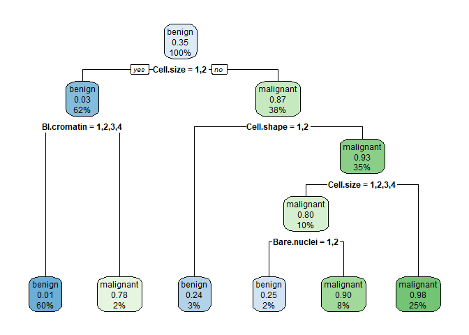
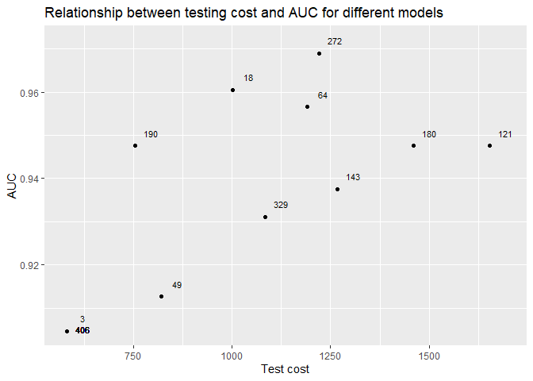
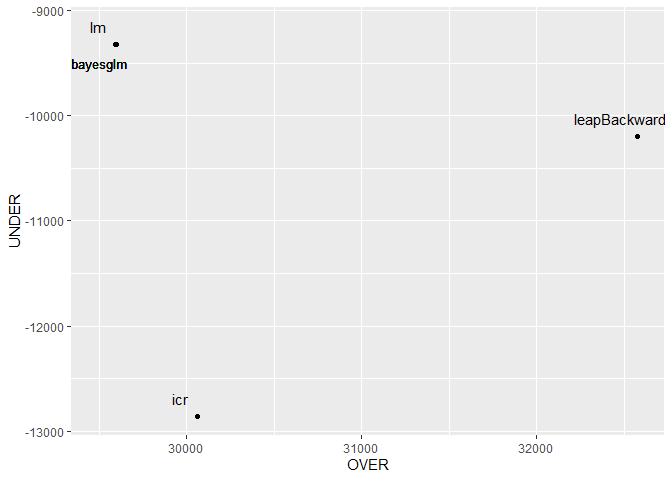

Exercise Evaluation-EDM-GCD-ETSINF
================

#### Authors:

  - Jose Giner
  - Andrés Calandín

## Exercise 1

Use the dataset abalone with the following train/test partition.
Consider that the distance between “high” and “low” is 2, while the
distance between “medium” and the rest is 1. Use these distances as
costs. Try to learn a model (using only the train data) that minimises
the cost measured with the test partition.

``` r
library(caret)
```

    ## Warning: package 'caret' was built under R version 4.0.3

    ## Loading required package: lattice

    ## Loading required package: ggplot2

    ## Warning: package 'ggplot2' was built under R version 4.0.4

``` r
library(mlr)
```

    ## Warning: package 'mlr' was built under R version 4.0.3

    ## Loading required package: ParamHelpers

    ## Warning: package 'ParamHelpers' was built under R version 4.0.3

    ## 'mlr' is in maintenance mode since July 2019. Future development
    ## efforts will go into its successor 'mlr3' (<https://mlr3.mlr-org.com>).

    ## 
    ## Attaching package: 'mlr'

    ## The following object is masked from 'package:caret':
    ## 
    ##     train

``` r
abalone <- read.csv("http://archive.ics.uci.edu/ml/machine-learning-databases/abalone/abalone.data", 
    header = FALSE)
names(abalone) <- c("sex", "length", "diameter", "height", "weight.whole", "weight.shucked", 
    "weight.viscera", "weight.shell", "rings")
abalone$sex<-factor(abalone$sex)
abalone$rings<-cut(abalone$rings,breaks=c(0,8,11,100),labels=c("low","medium","high"))
set.seed(280)
#hv<-hv[complete.cases(hv),]
hv_index <- createDataPartition(abalone$rings, p = .75, list = FALSE)
tr <- abalone[ hv_index, ]
te <- abalone[-hv_index, ]
```

Initially, we learn a classification model that predicts the “rings”
variable, fitting its parameters to the train partition. More
specifically, we had chosen a ‘Random Forest’ model, because after
trying with several models, this is the one that obtained the best
evaluation metrics.

``` r
ring.task = makeClassifTask(data = abalone, target = "rings")
lrn = makeLearner("classif.randomForest", predict.type = "prob")

mod = train(lrn, ring.task, subset = hv_index)
```

### Cost matrix

Next, we must define the cost matrix with the mentioned costs and set
the names of the rows and columns according to rings’ measures
(“low”,“medium”,“high”), corresponding to the class labels. Also,
a performance measure `ring.costs` is created to measure the average
costs of the data.

``` r
costs = matrix(c(0,1,2,1,0,1,2, 1,0), 3)
colnames(costs) = rownames(costs) = getTaskClassLevels(ring.task)
costs
```

    ##        low medium high
    ## low      0      1    2
    ## medium   1      0    1
    ## high     2      1    0

``` r
ring.costs = makeCostMeasure(id = "ring.costs", name = "Ring costs", costs = costs,
  best = 0, worst = 2)
```

### Thresholding

In this section, first we calculate a theoretical threshold that
consists of 1/average cost of true classes. Resampled values are used in
order to avoid overfitting in the training set when predicting class
probabilities.

``` r
rin = makeResampleInstance("CV", iters = 5, task = ring.task)
r = resample(lrn, ring.task, resampling = rin, measures = list(ring.costs, mmce), show.info = FALSE)
```

``` r
th = 1/rowSums(costs)
names(th) = getTaskClassLevels(ring.task)
th
```

    ##       low    medium      high 
    ## 0.3333333 0.5000000 0.3333333

``` r
pred.th = setThreshold(r$pred, threshold = th)
performance(pred.th, measures = list(ring.costs, mmce))
```

    ## ring.costs       mmce 
    ##  0.3545635  0.3313403

As we can see, threshold values for high and low classes are higher than
the medium class.

Next we will use another method to establish the threshold, that
consists of a standardized version of a class weight vector. In order to
define the weights, we have selected the SimpleCost algorithm, where
each component is calculated as follows:

\(w(i) = \frac{nc(i)}{\sum^{K}_{k=1}n(k)c(k)}\) ,where:

\-\(c(i)\) is the column sum of component \(i\) in the cost matrix

\-\(n(k)\) is the number of examples in class \(k\)

\-\(K\) is the number of classes

\-\(n\) is the total number of examples in the training set

``` r
n = length(hv_index)

res = 0
for (k in 1:length(levels(tr$rings))){
    res = res + table(tr$rings)[k] * rowSums(costs)[k]}
 
weight_vector<-c() 
for (i in 1:length(levels(tr$rings))) {
  w = (n*colSums(costs)[i]) / res
  weight_vector[i] = w }

th = weight_vector/sum(weight_vector)
th
```

    ## [1] 0.375 0.250 0.375

``` r
names(th) = getTaskClassLevels(ring.task)
pred.th = setThreshold(r$pred, threshold = th)
performance(pred.th, measures = list(ring.costs, mmce))
```

    ## ring.costs       mmce 
    ##  0.3308618  0.3222422

As we can see, threshold values differ from the previous ones. Medium
class has a lower value, and low high classes have a higher one this
time. Also mean cost reduces.

We then calculate the empirical threshold. Threshold is tuned with the
resampled set to avoid overfitting.

``` r
tune.res = tuneThreshold(pred = r$pred, measure = ring.costs) #Empirical threshold 
tune.res
```

    ## $th
    ##       low    medium      high 
    ## 0.3710660 0.2691049 0.3598291 
    ## 
    ## $perf
    ## [1] 0.3272684

These cost-optimal threshold values look more similar to the ones in our
second method using the class weights.

### Weighting

Here, we will apply the class weights (determined by the Simple Cost
algorithm) calculated before from the cost matrix, to give more
importance to those classes responsable of increasing the average cost.
As Random Forest learner does not support weights, we will use a version
of support vector machine instead `classif.ksvm` that supports class
weights, with the aim to see if mean cost reduces.

``` r
lrn2 = makeWeightedClassesWrapper("classif.ksvm", wcw.weight = weight_vector)
r = resample(lrn2, ring.task, rin, measures = list(ring.costs, mmce), show.info = FALSE)
r
```

    ## Resample Result
    ## Task: abalone
    ## Learner: weightedclasses.classif.ksvm
    ## Aggr perf: ring.costs.test.mean=0.3416426,mmce.test.mean=0.3184165
    ## Runtime: 4.72387

Metrics have not improved that much therefore we\`ll stick to the
empirical threshold as the cost sensitive method to evaluate the impact
in the test set.

### Evaluation of average cost using the test set

The empirical threshold `tune.res$th` calculated above from the
resampled set, is applied to our test set probabilities from the Random
Forest classifier:

``` r
test_index = as.integer(rownames(te))
probs_test <- predict(mod, task = ring.task, subset = test_index)
pred.th_emp = setThreshold(probs_test, tune.res$th)
pred.th_emp
```

    ## Prediction: 1043 observations
    ## predict.type: prob
    ## threshold: low=0.37,medium=0.27,high=0.36
    ## time: 0.10
    ##    id  truth prob.low prob.medium prob.high response
    ## 4   4 medium    0.216       0.714     0.070   medium
    ## 8   8   high    0.056       0.652     0.292   medium
    ## 9   9 medium    0.358       0.592     0.050   medium
    ## 13 13 medium    0.184       0.264     0.552     high
    ## 14 14 medium    0.142       0.536     0.322   medium
    ## 19 19    low    0.302       0.584     0.114   medium
    ## ... (#rows: 1043, #cols: 6)

Now we compare results:

``` r
performance(probs_test, measures = list(ring.costs, mmce))
```

    ## ring.costs       mmce 
    ##  0.3231064  0.3106424

``` r
performance(pred.th_emp, measures = list(ring.costs, mmce))
```

    ## ring.costs       mmce 
    ##  0.3154362  0.3058485

By applying this empirical threshold, mean cost has decreased nearly by
0.01 and so has the misclassification error.

Next we tried to implement the metacost classification technique by
doing a copy of the predefined function in R, as we could not run it
directly from the package due to our program version of R. The aim was
to minimize more the testing cost but the relabling of the training
examples didn’t convince us because the medium class was empty:

``` r
metacostClassif <- function(preds, cb.matrix) {
    if (missing(cb.matrix)) stop("MetaCost requires that you specify a cost-benefit matrix.",call.=FALSE)
    if (is.null(dim(preds))) stop("MetaCost requires that the classifier outputs a matrix of probabilities as predictions.",call.=FALSE)
    if (ncol(preds) != ncol(cb.matrix)) stop("Error in MetaCost: predictions do not contain as many class probabilities as there are classes in the cost-benefit matrix.",call.=FALSE)

    ps <- apply(preds,1,
                function(ps) which.max(apply(cb.matrix,2,
                                             function(cs) sum(ps*cs))))
    factor(colnames(preds)[ps],levels=colnames(preds))
}
```

``` r
probs_train =  predict(mod, task = ring.task, subset = hv_index)
probs = as.data.frame(probs_train)[,c(3:5)]
names(probs) = c("low","medium","high")
trainMeta = metacostClassif(probs, costs) #Nuevas etiquetas

tr$rings = trainMeta #Relabling the examples from the train set
table(tr$rings)
```

    ## 
    ##    low medium   high 
    ##   1523      0   1611

## Exercise 2

Consider the dataset Breastcancer with the following partition
train/test. Consider the test costs for each attribute given by the
array testcosts (the first position of the array corresponds to the
first attribute, CL.thickness, the second to Cell.size..). Try to
minimise the cost of testing while getting a good accuracy. Show the
best models in a plot AUC versus test cost (measured in the test
dataset)

``` r
library(mlbench)
```

    ## Warning: package 'mlbench' was built under R version 4.0.3

``` r
library(caret)
data(BreastCancer)
BreastCancer<-BreastCancer[,-1]
set.seed(280)
BreastCancer<-BreastCancer[complete.cases(BreastCancer),]
hv_index <- createDataPartition(BreastCancer$Class, p = .75, list = FALSE)
tr <- BreastCancer[ hv_index, ]
te <- BreastCancer[-hv_index, ]
testscosts<-c(2,4,3,1,5,3,2,4,2,0) 
```

### Model selection

For this exercise, we have chosen an rpart model to take into acount the
variable costs. Initialy, we are going to illustrate how the
classification tree is defined to have a first contact with the way it
works. Also we will apply the function `postResample` to calculate the
accuracy due to the predicting´s variable type, which is a factor
(benign/malign). To train these models, we used the rpart train method
instead of the caret one because we didn´t find a way to introduce these
atribute costs while training.

In this example, we are going to use all variables to predict the class
label and the method appliyed must be `class` as individuals are
classified in either benign class or malign class.

``` r
library(rpart)
```

    ## Warning: package 'rpart' was built under R version 4.0.3

``` r
library(rpart.plot)
```

    ## Warning: package 'rpart.plot' was built under R version 4.0.3

``` r
library(treeClust)
```

    ## Warning: package 'treeClust' was built under R version 4.0.4

    ## Loading required package: cluster

``` r
fit <- rpart(Class ~ ., data = tr, method = 'class')
rpart.plot(fit)
```

<!-- -->

``` r
bh_pred <- predict(fit, te, type = "class")
postResample(pred = bh_pred, obs = te$Class)
```

    ##  Accuracy     Kappa 
    ## 0.9352941 0.8589105

### Funtion parent()

Before going deep into explaining our method to measure the test cost in
a particular model, we are going to introduce a function called `parent`
which tells us the node labels of its parents. This function will first
check if the node label is 1 (it´s the root node and does not have
parents). In other case, it will find if it is possible to split each
node by two, where the children’s labels will be 2x their parent´s label
+ 0 (left node) or + 1 (right node). The function will return the node
path, starting from the root node until the desired node.

``` r
parent <- function(x) {
  if (x[1] != 1)
    c(Recall(if (x %% 2 == 0L) x / 2 else (x - 1) / 2), x) else x
}
```

### Calculating the test cost from every model

Next step is to define a function that assigns the correct test cost. To
perform this, we must predict the leaf label that contains each example
so by calling the function `rpart.predict.leaves()` we’ll know this
information. From here, we can calculate the frecuencies for each leaf
node and proceed with the cost calculation. The first for loop will
start iterating over every leaf node and will make use of the previous
parent function to search for its parents in the tree. In this way, it
is possible to know the variables associated to each internal node by
indexing at the `frame` option from the rpart fit object.

The second loop will cover each named variable found in the path for
each leaf node, and associate its corresponding cost value from the
initial vector `testscosts` to that leaf. Therefore, cost is calculated
individually for each leaf node (depending on the cost of the splitting
variables found previously and the number of examples predicted to be
there) , where variable `coste` contains the accumulated cost per leaf.
Finally the cost for each leaf is appended into a dataframe row,
indicating both the leaf number and its cost. The totalized cost is then
returned by adding up all the values for cost column.

``` r
cost_model <- function(fit) {
  leaf_pred = rpart.predict.leaves(fit, te, type = "where")
  names(leaf_pred) <- NULL 
  vectorHojas = tabulate(leaf_pred)
  
  costPerLeaf <- data.frame(Leaf_Num=factor(), Cost=integer())
  
  for (i in sort(unique(leaf.numbers(fit)))){ #Para cada hoja me apunto sus ancestros hasta la raiz
    
    pos =  which(rownames(fit$frame) == i)
    elem_hoja = vectorHojas[pos]
    antecesores = parent(i)
    atributos = fit$frame[rownames(fit$frame) %in% antecesores[1:length(antecesores) -1], 'var']
  
    coste = 0
  
    for (v in atributos){                   #Para cada variable encontrada de la raiz a la hoja, tengo en cuenta su coste y lo multiplico por 
                                            #las muestras predichas en esa hoja (es decir, que han atravesado ese camino y por tanto esa variable). 
      ind_var = which(colnames(te) == v)
      coste = coste + (testscosts[ind_var] * elem_hoja)}
    
  
    df = data.frame(Leaf_Num = i, Cost = coste)
    costPerLeaf = rbind(costPerLeaf,df)
    }
  

  coste_total = sum(costPerLeaf$Cost)
  coste_total
}

ctotal = cost_model(fit)
ctotal
```

    ## [1] 1398

We thought of using a metric to measure the balance between accuracy and
cost that consists on a ratio between them to quantify how good is the
model behaving with certain variables.However, we finally didn´t took it
into consideration as we remembered that the function `order` existed
and used it to sort results by cost and accuracy.

``` r
ac = postResample(pred = bh_pred, obs = te$Class)[1]
ratioAcPerCost = ac/ctotal
ratioAcPerCost
```

    ##    Accuracy 
    ## 0.000669023

### Methodology to solve the problem

To find the cost of several rpart models, we have splitted the training
set in such way that the variables are selected according to a
combination function from gtools package, that enables us to find all
different ways to place them in the model. For each variable
combination, we started iterating the ones with length of 3 variable
names as we thought that with less, it was not enough to explain the
variable to predict. The variable `costesmodelo` stores the
corresponding costs to the selected variable combination and once the
model is trained, test cost is calculated from previous function.
Predictions are made and used for accuracy and area under the curve
(auc) representations, where this information is added into a dataframe
as a new row for every model, and later, select the best ones.

``` r
library(gtools)
```

    ## Warning: package 'gtools' was built under R version 4.0.3

``` r
library(pROC)
```

    ## Warning: package 'pROC' was built under R version 4.0.3

``` r
x = tr[,-10]
tablaModelos <- data.frame(Variables= character(), Total_Cost=integer(), Accuracy = integer(), Ratio_Ac_Cost = integer(), AUC = integer())
for (i in c(3:length(colnames(x)))){
  #Encontrar combinaciones de variables
  comb = combinations(9,i, colnames(x))
  for (j in c(1:nrow(comb))){      #Recorrido de las combinaciones sin repetición
    vars_selected = comb[j,]
    costes_modelo = testscosts[match(vars_selected,colnames(tr))]
    fit <- rpart(Class ~., data = tr[,which(colnames(tr) %in% c(vars_selected, "Class"))], method = 'class', cost = costes_modelo)
    c = cost_model(fit)
    bh_pred <- predict(fit, te, type = "class")
    
    #Area under the curve
    ROC1 <- roc(as.numeric(te$Class), as.numeric(bh_pred))
    auc1 <- auc(ROC1)
    
    accu = postResample(pred = bh_pred, obs = te$Class)[1]
    ratio = accu/c
    df2 = data.frame(Variables = toString(vars_selected), Total_Cost = c, Accuracy = accu, Ratio_Ac_Cos = ratio, AUC = auc1)
    tablaModelos= rbind(tablaModelos, df2)
    }
}
 rownames(tablaModelos) = 1:nrow(tablaModelos)
```

Here we sort the dataframe ascending by cost and descending by accuracy,
in such way the best models are in the first rows.

``` r
tablaFinal = tablaModelos[order(tablaModelos$Total_Cost, -tablaModelos$Accuracy),]
head(tablaFinal)
```

    ##                                     Variables Total_Cost  Accuracy Ratio_Ac_Cos
    ## 3      Bare.nuclei, Bl.cromatin, Cl.thickness        580 0.9117647  0.001572008
    ## 30      Bl.cromatin, Cell.shape, Cl.thickness        580 0.9117647  0.001572008
    ## 35       Bl.cromatin, Cell.size, Cl.thickness        580 0.9117647  0.001572008
    ## 41   Bl.cromatin, Cl.thickness, Marg.adhesion        580 0.9117647  0.001572008
    ## 42         Bl.cromatin, Cl.thickness, Mitoses        580 0.9117647  0.001572008
    ## 43 Bl.cromatin, Cl.thickness, Normal.nucleoli        580 0.9117647  0.001572008
    ##          AUC
    ## 3  0.9046419
    ## 30 0.9046419
    ## 35 0.9046419
    ## 41 0.9046419
    ## 42 0.9046419
    ## 43 0.9046419

We select 11 models according to a step rule because the first ones have
same metric values as a result of the sorting process. By doing this we
can clearly differentiate each model in the final plot.

``` r
dispSet = tablaFinal[seq(1,466,45),]
head(dispSet)
```

    ##                                                                          Variables
    ## 3                                           Bare.nuclei, Bl.cromatin, Cl.thickness
    ## 406 Bl.cromatin, Cell.shape, Cl.thickness, Marg.adhesion, Mitoses, Normal.nucleoli
    ## 190                       Cell.shape, Cl.thickness, Marg.adhesion, Normal.nucleoli
    ## 49                                           Bl.cromatin, Mitoses, Normal.nucleoli
    ## 18                                         Bare.nuclei, Cell.size, Normal.nucleoli
    ## 329              Cell.shape, Cl.thickness, Marg.adhesion, Mitoses, Normal.nucleoli
    ##     Total_Cost  Accuracy Ratio_Ac_Cos       AUC
    ## 3          580 0.9117647 0.0015720081 0.9046419
    ## 406        580 0.9117647 0.0015720081 0.9046419
    ## 190        754 0.9470588 0.0012560462 0.9475492
    ## 49         820 0.9117647 0.0011119082 0.9125821
    ## 18        1001 0.9588235 0.0009578657 0.9605283
    ## 329       1084 0.9411765 0.0008682440 0.9311345

Finally we show the resulting scatter plot, of test cost against Area
Under the Curve, where each model is labeled by its row number. We can
see a slightly positive correlation between these two metrics, meaning
that models with greater test costs tend to have higher areas. There is
a case where several models can share coordinates and so we’ve labeled
all to distinguish them.

``` r
ggplot(dispSet, aes(x = Total_Cost, y = AUC)) + geom_point() + 
  geom_text(label= rownames(dispSet),
            nudge_x = 40, nudge_y = 0.003,
    check_overlap = TRUE, size = 3) + geom_text(x = 620, y = 0.905 , label = '406', size = 3) + xlab('Test cost') + ggtitle('Relationship between testing cost and AUC for different models')
```

<!-- -->

## Exercise 3

Given the following dataset and the partition train/test. Try to learn a
regression model with the best performance (considering the test
dataset) where the cost is computed following the paper “ROC Curves for
Regression”
<https://riunet.upv.es/bitstream/handle/10251/40252/PUBL157-PATREC2013-ROCCurvesRegression-paper.pdf?sequence=2>
with alfa =0.2. Plot the RROC and the RCOST Curves for the best 4
models. <http://josephorallo.webs.upv.es/RROC/>

``` r
setwd("C:\\Users\\Jose Giner\\OneDrive\\Documentos\\Asignaturas UPV\\Asignaturas Tercero\\EDM\\Tema 1")
dat<-read.csv("swCSC.csv",stringsAsFactors = TRUE)
dat<-dat[,-7]
set.seed(280)
hv_index <- createDataPartition(dat$Actual.effort..Hours., p = .75, list = FALSE)
tr <- dat[ hv_index, ]
te <- dat[-hv_index, ]
```

### Function `get_RROC_coords`

We created a function that given a set of regression models, it fits
them with the training data and uses its predicted values, in this case
for the variable `Actual.effort..Hours.`, to calculate the error for
each test observation in order to return the under and over estimations
for every model passed to the function, in form of a data frame called
`tableCoords`. We must also mention that for each model, another
internal data frame `errores` is created to store the actual value (y),
predicted value (y\_hat) and error for every observation. At last,
values for columns UNDER and OVER from `tableCoords` are calculated by
adding up the under and over estimations respectively.

``` r
get_RROC_coords <- function(model_names) {
  
  tableCoords <- data.frame(model = character() , OVER = numeric(), UNDER = numeric())
  for (m in model_names){
    fitM <- caret::train(Actual.effort..Hours. ~ .,
                data = tr, 
                method = m)

    predictions <- predict(fitM, te)
    
    pred_names = names(predictions)
    names(predictions) <- NULL
    
    errores <- data.frame(row_num = factor() , y = numeric(), y_hat = numeric(), error = numeric())
  
    cont = 1
    for (num in pred_names){
      v_real = te[num,6]
      v_pred = predictions[cont]
      cont = cont + 1
      e = v_real - v_pred
      df3 = data.frame(row_num = num, y = v_real, y_hat = v_pred, error = e)
      errores = rbind(errores, df3) 
    }

    sumaPos = 0
    sumaNeg = 0

    for (i in errores$error){
      if (i > 0){
        sumaPos = sumaPos + i}
  
      else{
        sumaNeg = sumaNeg + i}
    
    }
  
    df4 = data.frame(model = m, OVER = sumaPos, UNDER = sumaNeg)
    tableCoords = rbind(tableCoords, df4) 
  }
  
  tableCoords
  
}
```

We then test the function by passing a list of 4 regression models:

``` r
reg_models = c("lm","bayesglm", "leapBackward", "icr")
tCoords = get_RROC_coords(reg_models)
tCoords
```

Model names are shown with their total over and under estimations. Next
step is to plot these set of coordinates in a RROC space.

### Displaying the results

The package `ggplot2` is used to create the RROC space, showing where
each model lies in. Again, we distinguish between points that overlap.

``` r
ggplot(tCoords, aes(x = OVER , y = UNDER)) + geom_point() + 
  geom_text(label= tCoords$model, nudge_x = - 100, nudge_y = 170, check_overlap = TRUE) +
  geom_text(x = 29500, y = -9500, label= "bayesglm", size = 3.5)
```

<!-- -->

#### Other libraries used

``` r
library(rpart)
library(rpart.plot)
library(treeClust)
```
