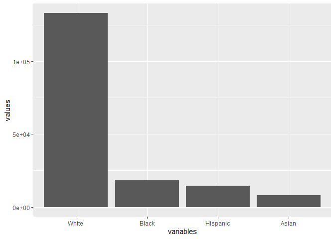

Fairness: fairness affects profits
================
Jose Giner

## Exercise 1 (already implemented):

Prepare the database. From the files
transrisk\_performance\_by\_race\_ssa.csv,
transrisk\_cdf\_by\_race\_ssa.csv and totals.csv calculate (for each
race):

1.    - The true possives per Score.

2.    - The true positives per Score relative to the total.

3.    - The accumulated of true positives relative per score.

4.    - The same (1, 2 and 3) for the false positives.

5.    - The relative profits per score.

6.    - The total profits per score.

7.    - The accumuated relative profits per score (using values computed
        in step 5).

8.    - The accumulated profits per score (using totals computed in step
        6).

<!-- end list -->

``` r
library(dplyr)
library(reshape2)
library(spatstat.utils)
library(ggplot2)


#setwd("C:\\Users\\Jose Giner\\OneDrive\\Escritorio\\EDM\\Practica 1 Sin sol")

performance <- read.csv("transrisk_performance_by_race_ssa.csv")
cdf <- read.csv("transrisk_cdf_by_race_ssa.csv")
total <- read.csv("totals.csv")
names(performance)[2] <- "White"
names(total)[2] <- "White"
names(cdf)[2] <- "White"

cutoff <- 5.0/6.0 #Asumimos que dar el préstamo y no pargarlo es 5 veces más costoso que darle el prestamo y que lo pague
performance[,2:5] <- (100 - performance[,2:5])/100
cdf[,2:5] <- cdf[,2:5]/100

df <- diff(cdf$White)
cdf$sWhite <- c(cdf$White[1], df)
df <- diff(cdf$Black)
cdf$sBlack <- c(cdf$Black[1], df)
df <- diff(cdf$Hispanic)
cdf$sHispanic <- c(cdf$Hispanic[1], df)
df <- diff(cdf$Asian)
cdf$sAsian <- c(cdf$Asian[1], df)

cdf$TPWhite <- performance$White * cdf$sWhite 
cdf$TPWhite <- cdf$TPWhite / sum(cdf$TPWhite)
cdf$FPWhite <- (1-performance$White) * cdf$sWhite 
cdf$FPWhite <- cdf$FPWhite /sum(cdf$FPWhite)
cdf$TPcWhite <- revcumsum(cdf$TPWhite)
cdf$FPcWhite <- revcumsum(cdf$FPWhite)
cdf$TPBlack <- performance$Black * cdf$sBlack 
cdf$TPBlack <- cdf$TPBlack / sum(cdf$TPBlack)
cdf$FPBlack <- (1-performance$Black) * cdf$sBlack 
cdf$FPBlack <- cdf$FPBlack /sum(cdf$FPBlack)
cdf$TPcBlack <- revcumsum(cdf$TPBlack)
cdf$FPcBlack <- revcumsum(cdf$FPBlack)
cdf$TPHispanic <- performance$Hispanic * cdf$sHispanic 
cdf$TPHispanic <- cdf$TPHispanic / sum(cdf$TPHispanic)
cdf$FPHispanic <- (1-performance$Hispanic) * cdf$sHispanic 
cdf$FPHispanic <- cdf$FPHispanic /sum(cdf$FPHispanic)
cdf$TPcHispanic <- revcumsum(cdf$TPHispanic)
cdf$FPcHispanic <- revcumsum(cdf$FPHispanic)
cdf$TPAsian <- performance$Asian * cdf$sAsian 
cdf$TPAsian <- cdf$TPAsian / sum(cdf$TPAsian)
cdf$FPAsian <- (1-performance$Asian) * cdf$sAsian 
cdf$FPAsian <- cdf$FPAsian /sum(cdf$FPAsian)
cdf$TPcAsian <- revcumsum(cdf$TPAsian)
cdf$FPcAsian <- revcumsum(cdf$FPAsian)

performance$pWhite <- performance$White - cutoff
performance$pBlack <- performance$Black - cutoff
performance$pHispanic <- performance$Hispanic - cutoff
performance$pAsian <- performance$Asian - cutoff

performance$ptWhite <- performance$pWhite * cdf$sWhite * total$White
performance$ptBlack <- performance$pBlack  * cdf$sBlack * total$Black
performance$ptHispanic <- performance$pHispanic  * cdf$sHispanic * total$Hispanic
performance$ptAsian <- performance$pAsian  * cdf$sAsian * total$Asian

performance$ptcWhite <- revcumsum(performance$ptWhite)
performance$ptcBlack <- revcumsum(performance$ptBlack)
performance$ptcHispanic <- revcumsum(performance$ptHispanic)
performance$ptcAsian <- revcumsum(performance$ptAsian)

performance$pcWhite <- revcumsum(performance$pWhite)
performance$pcBlack <- revcumsum(performance$pBlack)
performance$pcHispanic <- revcumsum(performance$pHispanic)
performance$pcAsian <- revcumsum(performance$pAsian)
```

## Exercise 2: Distribution of the samples.

Build a barplot with the score distribution by ethnicity.

``` r
variables = colnames(total)[2:5]
values = as.numeric(total[1,2:5])
total2 = data.frame(variables, values)

ggplot(total2, aes(x= variables, y = values)) + 
  geom_bar(stat = "identity") + scale_x_discrete(limits = variables)
```

<!-- -->

## Exercise 3: Draw 3 plots:

1.    - One that shows the absolute profits by race depending on the
        score threshold

2.    - A second one that shows the relative profits by race depending
        on the score threshold

3.    - The third one the ROC curve of each race (the four curves in the
        same plot)

<!-- end list -->

``` r
library(tidyr)
```

    ## Warning: package 'tidyr' was built under R version 4.0.3

    ## 
    ## Attaching package: 'tidyr'

    ## The following object is masked from 'package:reshape2':
    ## 
    ##     smiths

``` r
p1 = performance %>%
    gather(variable,value, ptcWhite, ptcBlack, ptcHispanic, ptcAsian) 
      
p1 %>% 
  ggplot(aes(x= Score, y=value, colour=variable)) +  scale_x_reverse() +
      geom_line() + ggtitle("Absolute profits by race and thresholded score") + xlab("Score threshold") + ylab("Profits") 
```

<!-- -->

``` r
p2 = performance %>%
  gather(variable,value, pcWhite, pcBlack, pcHispanic, pcAsian)

p2 %>%
    ggplot(aes(x= Score, y=value, colour=variable)) +  scale_x_reverse() +
    geom_line() + ggtitle("Relative profits by race and thresholded score") + xlab("Score threshold") + ylab("Relative Profits") 
```

<!-- -->

``` r
cdf1 = cdf %>%
   gather(variable1, val1, TPcWhite, TPcBlack, TPcHispanic, TPcAsian) 

cdf2 = cdf %>% gather(variable2, val2, FPcWhite, FPcBlack, FPcHispanic, FPcAsian)
cdf3 = cdf %>% gather(Race, val3, White, Black, Hispanic, Asian)
cdf4 = cbind(cdf1,cdf2[,23])
cdf4 = cbind(cdf4,cdf3[,22])
colnames(cdf4)[24:25] = c('val2','Race')


cdf4 %>% 
    ggplot() + 
    geom_line(aes(x=val2, y= val1, color = Race)) + ggtitle("ROC Curve") + xlab("FP") + ylab("TP") 
```

<!-- -->

**QUESTION:** **Can you see strong dependencies on the race group? Make
zoom at the maximum curvature point. What can you see there? **

From the absolute profits by race graph, when white´s profit starts to
fall, we can appreciate that other racial´s groups profits also start to
decrease more or less at the same threshold score value as a
consecuence, so there could be a dependence. In the relative profits by
race graph, the evolution is the same for all groups but the maximun
curvature point differs, and it is the Black race that reaches before to
this point as well as being the lowest one. In the ROC curves the same
thing happens, where all groups seem to have similar area under the
curve.

## Exercise 4: MAXIMUM PROFIT:

Pick group-dependent score thresholds in a way that maximizes profit.
Compute this value and show it in the three plots built in the previous
exercise Compute the resulting profits of this decision.

``` r
c = 1
TotprofitMax = 0
listaScores = c()

for (P.raza in performance[,14:17]){
  c = c + 1
  scoreMax = performance$Score[which.max(P.raza)]
  print(paste0(colnames(performance)[c]," score: ",scoreMax ))
  listaScores = c(listaScores,scoreMax)

  TotprofitMax = TotprofitMax + max(P.raza)
}
```

    ## [1] "White score: 41"
    ## [1] "Black score: 49"
    ## [1] "Hispanic score: 47"
    ## [1] "Asian score: 38.5"

``` r
p1  %>%

      ggplot(aes(x= Score, y=value, color=variable)) +  scale_x_reverse() +
      geom_line() + geom_point(aes(x= Score[which.max(performance$ptcAsian)],y = max(performance$ptcAsian)), color = "red") +
      geom_point(aes(x= Score[which.max(performance$ptcBlack)],y = max(performance$ptcBlack)),color = "green") +
      geom_point(aes(x= Score[which.max(performance$ptcHispanic)],y = max(performance$ptcHispanic)), color = "blue") +
      geom_point(aes(x= Score[which.max(performance$ptcWhite)],y = max(performance$ptcWhite)), color = "purple") + ggtitle("Absolute profits by race and thresholded score") + xlab("Score threshold") + ylab("Profits") 
```

<!-- -->

``` r
p2%>%

      ggplot(aes(x= Score, y=value, color=variable)) +  scale_x_reverse() +
      geom_line() + geom_point(aes(x= Score[which.max(performance$pcAsian)],y = max(performance$pcAsian)), color = "red") +
      geom_point(aes(x= Score[which.max(performance$pcBlack)],y = max(performance$pcBlack)), color = "green") +
      geom_point(aes(x= Score[which.max(performance$pcHispanic)],y = max(performance$pcHispanic)) , color = "blue") +
      geom_point(aes(x= Score[which.max(performance$pcWhite)],y = max(performance$pcWhite)), color = "purple") + ggtitle("Relative profits by race and thresholded score") + xlab("Score threshold") + ylab("Profits") 
```

<!-- -->

``` r
cdf4 %>% 
    ggplot() +
    geom_line(aes(x=val2, y= val1, color = Race)) + ggtitle("ROC Curve") + xlab("FP") + ylab("TP") +
    geom_point(aes(x = cdf$FPcAsian[which(cdf$Score == listaScores[4])], y = cdf$TPcAsian[which(cdf$Score == listaScores[4])]), color = "red") +
    geom_point(aes(x = cdf$FPcBlack[which(cdf$Score == listaScores[2])], y = cdf$TPcBlack[which(cdf$Score == listaScores[2])]), color = "green") +
    geom_point(aes(x = cdf$FPcHispanic[which(cdf$Score == listaScores[3])], y = cdf$TPcHispanic[which(cdf$Score == listaScores[3])]), color = "blue") +
    geom_point(aes(x = cdf$FPcWhite[which(cdf$Score == listaScores[1])], y = cdf$TPcWhite[which(cdf$Score == listaScores[1])]), color = "purple")
```

<!-- -->

## Exercise 5: SINGLE THRESHOLD:

Pick a single uniform score threshold for all groups in a way that
maximizes profit. Compute this value and show it in the three plots
built in the exercise 2. Compute the resulting profits of this
decission.

``` r
profitsByScore = data.frame(Score = numeric(), Profit = numeric())

for (i in rownames(performance)){
  scorePr = 0
  for (j in 14:17){
    scorePr = scorePr + performance[i,j]
    
  }

  
  df3 = data.frame(Score = performance[i,1], Profit = scorePr)
  profitsByScore = rbind(profitsByScore, df3 )
  
}

ind_score = which.max(profitsByScore$Profit)
scoreMax = profitsByScore$Score[ind_score]
for (j in 2:5){
  print(paste0(colnames(performance)[j]," score: ",scoreMax ))
}
```

    ## [1] "White score: 42.5"
    ## [1] "Black score: 42.5"
    ## [1] "Hispanic score: 42.5"
    ## [1] "Asian score: 42.5"

``` r
profitMaxSingle = max(profitsByScore$Profit)
```

``` r
p1%>%

      ggplot(aes(x= Score, y=value, color=variable)) +  scale_x_reverse() +
      geom_line() + geom_point(aes(scoreMax , y = performance$ptcAsian[ind_score]), color = "red") +
      geom_point(aes(x= scoreMax , y = performance$ptcBlack[ind_score]), color = "green") +
      geom_point(aes(x= scoreMax , y = performance$ptcHispanic[ind_score]), color = "blue") +
      geom_point(aes(x= scoreMax , y = performance$ptcWhite[ind_score]), color = "purple") + ggtitle("Absolute profits by race and thresholded score") + xlab("Score threshold") + ylab("Profits") 
```

<!-- -->

``` r
p2  %>%

      ggplot(aes(x= Score, y=value, color=variable)) +  scale_x_reverse() +
      geom_line() + geom_point(aes(x= scoreMax,y = performance$pcAsian[ind_score]), color = "red") +
      geom_point(aes(x = scoreMax,y = performance$pcBlack[ind_score]), color = "green") +
      geom_point(aes(x= scoreMax ,y = performance$pcHispanic[ind_score]), color = "blue") +
      geom_point(aes(x= scoreMax ,y = performance$pcWhite[ind_score]), color = "purple") + ggtitle("Relative profits by race and thresholded score") + xlab("Score threshold") + ylab("Profits") 
```

<!-- -->

``` r
cdf4 %>%
  ggplot() +
    geom_line(aes(x=val2, y= val1, color = Race)) + ggtitle("ROC Curve") + xlab("FP") + ylab("TP") +
    geom_point(aes(x = cdf$FPcAsian[ind_score], y = cdf$TPcAsian[ind_score]), color = "red") +
    geom_point(aes(x = cdf$FPcBlack[ind_score], y = cdf$TPcBlack[ind_score]), color = "green") +
    geom_point(aes(x = cdf$FPcHispanic[ind_score], y = cdf$TPcHispanic[ind_score]), color = "blue") +
    geom_point(aes(x = cdf$FPcWhite[ind_score], y = cdf$TPcWhite[ind_score]), color = "purple")
```

<!-- -->

## Exercise 6: SEPARATION (partially implemented):

Achieve an equal true/false positive rate in all groups. Subject to this
constraint, maximize profit. Compute this value and show it in the ROC
curve built in the exercise 2 (in the other has no sense…. Why?) Compute
the resulting profits of this decission.

``` r
rsAsian <- approx(cdf$FPcAsian, cdf$TPcAsian, method = "linear", n=1001)
```

    ## Warning in regularize.values(x, y, ties, missing(ties), na.rm = na.rm):
    ## collapsing to unique 'x' values

``` r
rsAsian <- as.data.frame(rsAsian)
rsWhite <- approx(cdf$FPcWhite, cdf$TPcWhite, method = "linear", n=1001)
rsWhite <- as.data.frame(rsWhite)
rsBlack <- approx(cdf$FPcBlack, cdf$TPcBlack, method = "linear", n=1001)
rsBlack <- as.data.frame(rsBlack)
rsHispanic <- approx(cdf$FPcHispanic, cdf$TPcHispanic, method = "linear", n=1001)
rsHispanic <- as.data.frame(rsHispanic)

r <- cbind(rsWhite$y, rsBlack$y, rsHispanic$y, rsAsian$y)
r<- as.data.frame(r)
wm <- apply(r, 1, FUN = which.min)

r$x = 0
r$y = 0
r$profit = 0
for(i in 1:length(wm)){
   r$x[i] <- ifelse(wm[i] == 1, rsWhite$x[i], ifelse(wm[i] == 2, rsBlack$x[i], ifelse(wm[i] == 3, rsHispanic$x[i], rsAsian$x[i])))
   r$y[i] <- ifelse(wm[i] == 1, rsWhite$y[i], ifelse(wm[i] == 2, rsBlack$y[i], ifelse(wm[i] == 3, rsHispanic$y[i], rsAsian$y[i])))

   if(wm[i] == 1){
     index <- which.min(abs(cdf$TPcWhite - rsWhite$y[i]))
     r$profit[i] <- performance$pcWhite[index]
   }
   if(wm[i] == 2){
     index <- which.min(abs(cdf$TPcBlack - rsBlack$y[i]))
     r$profit[i] <- performance$pcBlack[index]
   }   
   if(wm[i] == 3){
     index <- which.min(abs(cdf$TPcHispanic - rsHispanic$y[i]))
     r$profit[i] <- performance$pcHispanic[index]
   }   
   if(wm[i] == 4){
     index <- which.min(abs(cdf$TPcAsian - rsAsian$y[i]))
     r$profit[i] <- performance$pcAsian[index]
   }   
}

indexl <- which.max(r$profit)
if(wm[indexl] == 1){
  index <- which.min(abs(performance$pcWhite - r$profit[indexl]))
  pROC <- c(cdf$FPcWhite[index], cdf$TPcWhite[index])
  profit <- performance$pcWhite[index]
}
if(wm[indexl] == 2){
  index <- which.min(abs(performance$pcBlack - r$profit[indexl]))
  pROC <- c(cdf$FPcBlack[index], cdf$TPcBlack[index])
  profit <- performance$pcBlack[index]
}   
if(wm[indexl] == 3){
  index <- which.min(abs(performance$pcHispanic - r$profit[indexl]))
  pROC <- c(cdf$FPcHispanic[index], cdf$TPcHispanic[index])
  profit <- performance$pcHispanic[index]
}   
if(wm[indexl] == 4){
  index <- which.min(abs(performance$pcAsian - r$profit[indexl]))
  pROC <- c(cdf$FPcAsian[index], cdf$TPcAsian[index])
  profit <- performance$pcAsian[index]
}

Score <- cdf$Score[index]

if(wm[indexl] == 1){
  TP = cdf$TPcWhite[which(cdf$Score == Score)] 
  FP = cdf$FPcWhite[which(cdf$Score == Score)] 
}
if(wm[indexl] == 2){
  TP = cdf$TPcBlack[which(cdf$Score == Score)] 
  FP = cdf$FPcBlack[which(cdf$Score == Score)] 
  
}   
if(wm[indexl] == 3){
  TP = cdf$TPcHispanic[which(cdf$Score == Score)] 
  FP = cdf$FPcHispanic[which(cdf$Score == Score)] 
}   
if(wm[indexl] == 4){
  TP = cdf$TPcAsian[which(cdf$Score == Score)] 
  FP = cdf$FPcAsian[which(cdf$Score == Score)] 
}

profWhite = profit * cdf$sWhite[index] * total$White
profBlack = profit * cdf$sBlack[index] * total$Black
profHispanic = profit * cdf$sHispanic[index] * total$Hispanic
profAsian = profit * cdf$sAsian[index] * total$Asian
profTotal = profWhite + profBlack + profHispanic + profAsian


#Dibuja EL PUNTO sobre la curva ROC. Recuerda calcular el beneficio
```

``` r
cdf4 %>%
  ggplot() +
    geom_line(aes(x=val2, y= val1, color = Race)) + ggtitle("ROC Curve") + xlab("FP") + ylab("TP") +
    geom_point(aes(x = FP, y = TP)) 
```

<!-- -->

## Exercise 7: INDEPENCENCE (partially implemented):

Achieve an equal acceptance rate in all groups. Subject to this
constraint, maximize profit. Compute this value and show it in the three
plots built in the exercise 2 Compute the resulting profits of this
decission.

``` r
cWhite <- 1
cBlack <- 1
cHispanic <- 1
cAsian <- 1
cont <- 1
ar <- 0
best_profit <- 0
actual_profit <- 0
Best_White <- 1
Best_Black <- 1
Best_Hispanic <- 1
Best_Asian <- 1

p <- select(cdf, White, Black, Hispanic, Asian)
pm <- melt(p)
```

    ## No id variables; using all as measure variables

``` r
pm <- pm[order(pm$value),]

maxcont <- 4 * nrow(cdf)
actual_profit <- performance$ptcWhite[cWhite] + performance$ptcBlack[cBlack] + performance$ptcHispanic[cHispanic] + performance$ptcAsian[cAsian]
best_profit <- actual_profit
while(cont <= maxcont)
{
  ar <- pm$value[cont]
  if(cdf$White[cWhite] < ar)
  {
    cWhite <- cWhite + 1
  }
  if(cdf$Black[cBlack] < ar)
  {
    cBlack <- cBlack + 1
  }
  if(cdf$Hispanic[cHispanic] < ar)
  {
    cHispanic <- cHispanic+ 1
  }
  if(cdf$Asian[cAsian] < ar)
  {
    cAsian <- cAsian + 1
  }
  
  actual_profit <- performance$ptcWhite[cWhite] + performance$ptcBlack[cBlack] + performance$ptcHispanic[cHispanic] + performance$ptcAsian[cAsian]
  if(actual_profit > best_profit)
  {
    best_profit <- actual_profit
    Best_White <- cWhite
    Best_Black <- cBlack
    Best_Hispanic <- cHispanic
    Best_Asian <- cAsian
  }
  
  cont <- cont +1
}
MP_index = data.frame(White = 0, Black = 0, Hispanic = 0, Asian = 0) 

MP_index$White <- Best_White
MP_index$Black <- Best_Black
MP_index$Hispanic <- Best_Hispanic
MP_index$Asian <- Best_Asian

MP_index
```

    ##   White Black Hispanic Asian
    ## 1   117    42       73   117

``` r
print(paste("White score: ",performance$Score[MP_index[1,1]]))
```

    ## [1] "White score:  58"

``` r
print(paste("Black score: ",performance$Score[MP_index[1,2]]))
```

    ## [1] "Black score:  20.5"

``` r
print(paste("Hispanic score: ",performance$Score[MP_index[1,3]]))
```

    ## [1] "Hispanic score:  36"

``` r
print(paste("Asian score: ",performance$Score[MP_index[1,4]]))
```

    ## [1] "Asian score:  58"

``` r
g1 = p1  %>%

      ggplot(aes(x= Score, y=value, color=variable)) +  scale_x_reverse() +
      geom_line() + ggtitle("Absolute profits by race and thresholded score")  + xlab("Score threshold") + ylab("Profits") 
  
g1 + geom_point(aes(x=performance$Score[MP_index$White], y=performance$ptcWhite[MP_index$White]), color = "purple") +
  geom_point(aes(x=performance$Score[MP_index$Black], y=performance$ptcBlack[MP_index$Black]), color = "green") +
  geom_point(aes(x=performance$Score[MP_index$Hispanic], y=performance$ptcHispanic[MP_index$Hispanic]), color = "blue") +
  geom_point(aes(x=performance$Score[MP_index$Asian], y=performance$ptcAsian[MP_index$Asian]), color = "red")
```

<!-- -->

``` r
g2 = p2 %>%
    ggplot(aes(x= Score, y=value, colour=variable)) +  scale_x_reverse() +
    geom_line() + ggtitle("Relative profits by race and thresholded score") + xlab("Score threshold") + ylab("Relative Profits") 
  
  
g2 + geom_point(aes(x=performance$Score[MP_index$White], y=performance$pcWhite[MP_index$White]), color = "purple") +
  geom_point(aes(x=performance$Score[MP_index$Black], y=performance$pcBlack[MP_index$Black]), color = "green") +
  geom_point(aes(x=performance$Score[MP_index$Hispanic], y=performance$pcHispanic[MP_index$Hispanic]), color = "blue") +
  geom_point(aes(x=performance$Score[MP_index$Asian], y=performance$pcAsian[MP_index$Asian]), color = "red")
```

<!-- -->

``` r
gROC = cdf4 %>% 
      ggplot() + 
      geom_line(aes(x=val2, y= val1, color = Race)) + ggtitle("ROC Curve") + xlab("FP") + ylab("TP") 

gROC + geom_point(aes(x=cdf$FPcWhite[MP_index$White], y=cdf$TPcWhite[MP_index$White]), color = "purple") +
  geom_point(aes(x=cdf$FPcBlack[MP_index$Black], y=cdf$TPcBlack[MP_index$Black]), color = "green") +
  geom_point(aes(x=cdf$FPcHispanic[MP_index$Hispanic], y=cdf$TPcHispanic[MP_index$Hispanic]), color = "blue") +
  geom_point(aes(x=cdf$FPcAsian[MP_index$Asian], y=cdf$TPcAsian[MP_index$Asian]), color = "red")
```

<!-- -->

``` r
IND_Profit <- best_profit
```

## Exercise 8:

Show the different profits obtained using the 4 “fairness” criteria
implemented: Maximum profit, single threshold, separation and
independence

``` r
print(paste0('Profit if we use Maximum Profit criteria: ',TotprofitMax))
```

    ## [1] "Profit if we use Maximum Profit criteria: 11968.57458893"

``` r
print(paste0('Profit if we use Single Threshold criteria: ',profitMaxSingle))
```

    ## [1] "Profit if we use Single Threshold criteria: 11888.1095257133"

``` r
print(paste0('Profit if we use Separation criteria: ', profTotal))
```

    ## [1] "Profit if we use Separation criteria: 10350.8117286566"

``` r
print(paste0('Profit if we use Independence criteria: ', IND_Profit))
```

    ## [1] "Profit if we use Independence criteria: 8253.01749189"

**QUESTIONS:** **Why has only sense to show the Separation criteria in
the ROC plot?** It is necessary to represent this criteria in a ROC
space because intersection points from ROC curves determine this optimal
thresholded score that minimizes cost.

**Does the criterion of fairness really affect the bank’s profits?** It
affects the bank’s profits because we can see that depending on the
thresholded score, the profits obtained will differ, where some groups
could benefit more than others. The Maximum Profit criteria produces the
most and maximum totalized profit and the Independence criteria the
least one.
