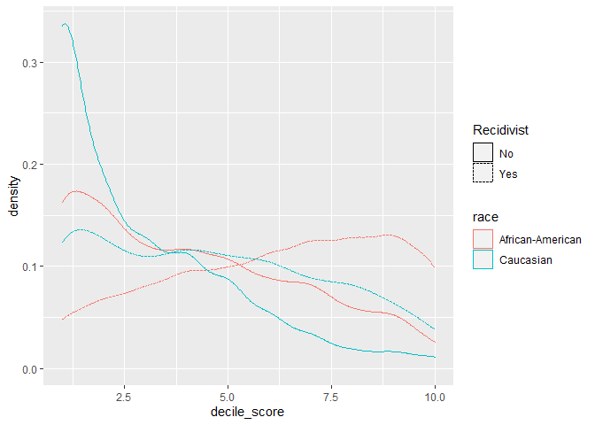
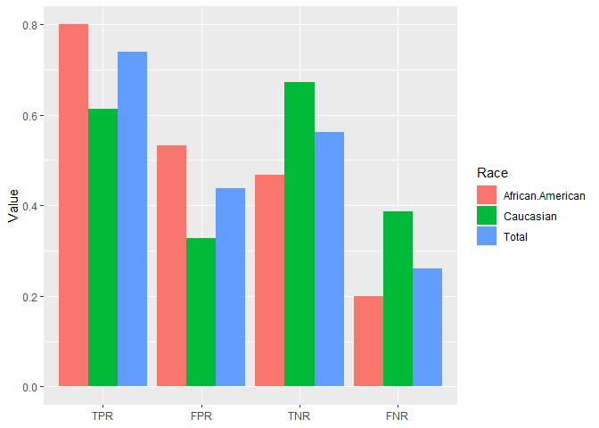
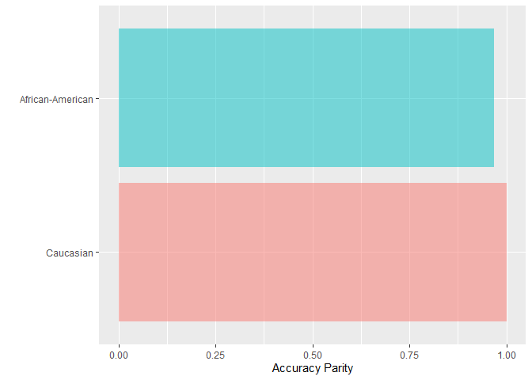
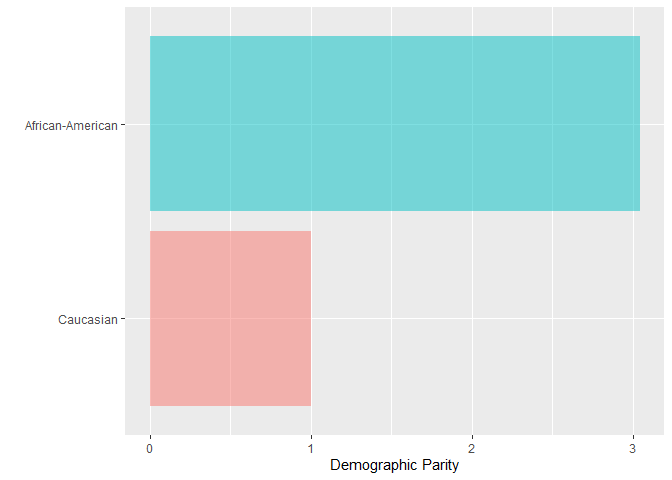
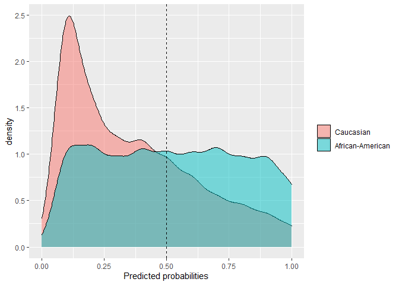
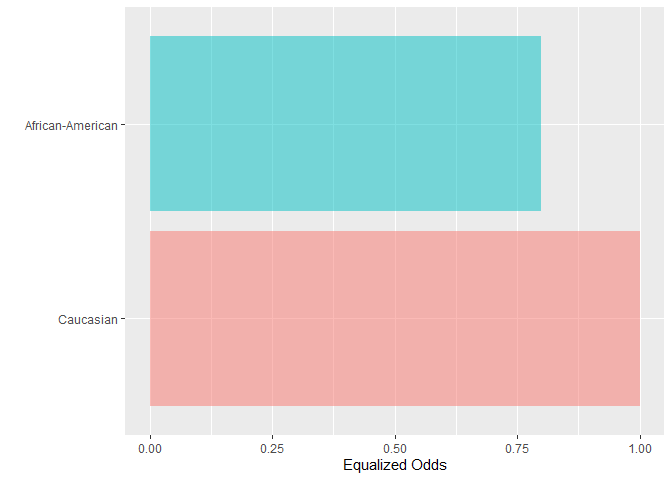
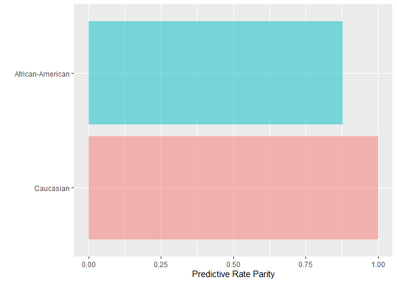

Fairness affects people: Criminal justice
================
Jose Giner

## EXERCISE 1:

Plot the fraction of defendants recidivating within two years
(two\_year\_recid == 1) as a function of risk score (decile\_score), for
black defendants (race == “African-American”) and white defendants (race
== “Caucasian”).

**QUESTIONS:**

**Based on these plots, does the risk score satisfy sufficiency across
racial groups in this dataset? This is somewhat subjective, since we
want to allow for approximate equality between groups; justify your
answer in a sentence or two.**

Sufficiency is satisfied when the objective variable (\(Y\)) is
independent of the sensitive variable (\(A\)) conditioned by the result
(\(R\)) : \(Y \perp A |R\) . In this case \(Y\) is the number of
defendants recidivating within two years, \(A\) is the racial group
(caucasian, african-american) and \(R\) is the decile score, but
sufficiency is not satisfied because n depends on the racial group given
the score value, as we can see from the plot.

``` r
library(dplyr)
library(plotly)
library(reshape2)

#setwd("C:\\Users\\Jose Giner\\OneDrive\\Escritorio\\EDM\\Practica 2 Sin sol")
compas <- read.csv("compas-scores-two-years.csv")

#Filtering process
compas = compas %>%
  filter(days_b_screening_arrest > -30 & days_b_screening_arrest < 30) 

compas1 = subset(compas, (race == "Caucasian" | race == "African-American") & two_year_recid == 1)

#Graph construction
plot_ly(compas1, x = ~decile_score, color = ~race) %>%
  add_histogram() %>% layout(yaxis = list(title = "n"))
```

<!--html_preserve-->

<div id="htmlwidget-72f1593b677f506cf270" class="plotly html-widget" style="width:672px;height:480px;">

</div>

<script type="application/json" data-for="htmlwidget-72f1593b677f506cf270">{"x":{"visdat":{"59602a634b0b":["function () ","plotlyVisDat"]},"cur_data":"59602a634b0b","attrs":{"59602a634b0b":{"x":{},"color":{},"alpha_stroke":1,"sizes":[10,100],"spans":[1,20],"type":"histogram","inherit":true}},"layout":{"margin":{"b":40,"l":60,"t":25,"r":10},"yaxis":{"domain":[0,1],"automargin":true,"title":"n"},"xaxis":{"domain":[0,1],"automargin":true,"title":"decile_score"},"hovermode":"closest","showlegend":true},"source":"A","config":{"showSendToCloud":false},"data":[{"x":[3,4,6,3,6,9,3,7,10,8,9,7,8,4,10,4,9,6,6,3,4,10,10,9,7,4,9,5,9,4,8,9,10,7,8,6,5,3,9,9,1,10,4,2,6,5,8,2,9,9,3,9,10,10,9,8,8,6,4,7,10,6,9,8,4,3,8,10,9,9,8,9,10,10,5,10,9,5,8,8,9,9,8,7,9,8,3,6,7,7,5,10,10,2,10,8,6,5,3,9,9,7,9,6,10,4,6,7,5,4,3,4,7,9,3,5,7,8,4,2,6,8,7,10,7,8,5,3,6,9,9,2,8,8,4,7,10,9,2,7,9,10,8,2,7,6,8,5,8,4,10,9,7,10,5,5,5,7,10,7,9,6,9,5,9,5,2,10,1,7,8,6,8,8,10,7,8,7,4,5,7,9,8,5,3,4,9,8,8,10,7,6,1,3,2,7,7,2,2,1,9,10,7,9,10,2,7,5,5,7,6,6,8,7,5,4,1,7,4,7,10,8,5,7,10,9,5,7,3,8,10,1,10,3,5,7,8,10,3,10,3,6,3,2,10,6,5,3,9,5,9,6,6,9,1,2,2,9,8,3,9,5,4,10,6,6,7,8,2,6,8,5,4,2,10,3,8,10,3,3,9,1,8,4,2,7,4,10,9,7,2,6,9,10,8,6,4,7,9,3,10,10,1,8,8,3,1,8,4,9,6,3,6,6,7,7,5,4,4,9,1,9,10,10,3,10,9,2,5,4,6,9,10,6,9,7,10,3,3,9,6,10,4,8,4,7,10,1,9,5,8,7,8,7,5,5,7,5,5,7,10,9,7,2,6,6,9,8,5,6,6,3,9,9,2,9,8,8,9,1,2,3,4,6,7,10,8,9,7,8,8,7,9,5,2,4,10,7,3,9,3,6,4,4,7,9,2,9,8,8,7,9,6,3,5,10,8,3,5,3,5,9,3,9,8,7,8,9,1,10,7,10,7,10,10,6,4,6,5,6,6,10,8,4,1,7,9,10,6,10,10,9,10,5,5,4,2,2,4,8,10,8,7,1,7,3,3,4,2,9,7,9,9,2,5,1,8,6,10,1,4,5,2,5,10,6,10,7,3,3,6,2,8,4,7,2,4,10,10,7,10,2,7,6,7,7,3,4,7,8,6,9,7,7,6,7,4,6,6,8,4,6,6,7,1,2,4,7,6,7,8,8,10,6,5,9,9,10,7,7,7,1,2,5,8,5,3,7,8,3,6,10,6,5,8,8,8,5,1,3,4,9,10,10,1,2,8,10,7,7,5,3,3,7,1,9,5,8,5,10,10,1,9,2,8,4,6,3,8,4,1,10,3,10,6,8,6,9,6,10,9,9,5,9,2,9,4,9,8,4,10,8,7,4,9,3,8,6,8,2,8,6,7,6,5,8,7,9,3,9,4,1,2,10,3,9,9,4,7,1,8,7,3,4,2,7,8,3,6,5,1,8,5,4,10,3,10,7,1,2,10,9,9,8,10,6,1,10,10,9,5,3,10,3,9,8,5,1,5,9,2,2,7,7,10,7,8,3,8,3,2,6,5,8,6,6,4,2,2,9,9,8,7,8,2,8,10,9,8,8,4,2,9,8,6,7,9,8,3,6,8,2,8,2,9,8,9,4,7,5,7,10,5,4,6,10,1,10,9,5,7,4,7,9,9,8,3,5,1,1,1,6,8,10,8,10,10,10,3,8,7,6,4,7,1,1,3,5,8,7,9,6,10,8,9,5,4,8,6,3,1,2,1,2,9,3,1,8,9,1,9,7,10,10,6,4,9,5,8,5,10,6,10,9,9,3,4,10,8,8,5,4,8,8,10,9,8,4,4,7,7,10,7,8,7,5,6,8,8,6,1,2,9,6,8,6,9,5,8,7,1,3,10,1,7,6,4,6,3,8,7,5,7,1,7,9,4,8,4,10,4,9,1,5,8,4,2,7,1,2,5,8,8,9,4,3,4,2,3,7,4,8,8,5,10,9,9,8,3,7,1,8,2,5,10,9,5,1,6,6,8,4,4,6,5,8,9,9,8,1,8,10,4,7,9,7,9,5,4,9,5,3,9,10,4,9,5,5,10,6,9,7,10,9,6,10,6,6,8,8,1,6,4,2,9,9,5,5,2,10,6,8,7,5,8,2,2,5,8,7,6,4,6,9,5,1,5,9,8,2,9,9,5,1,9,3,5,7,4,10,7,8,7,7,4,2,10,9,6,10,8,10,7,4,8,5,10,9,4,9,8,9,9,2,2,3,9,9,8,4,3,6,10,9,8,4,4,7,9,7,3,9,5,6,2,3,7,5,9,9,8,6,5,9,9,3,5,4,2,8,3,3,1,1,9,10,5,2,4,9,7,9,10,5,7,3,2,4,10,4,8,6,5,3,6,8,8,6,7,3,8,3,6,3,8,5,10,6,7,3,6,7,6,10,10,6,10,5,5,2,10,6,10,6,5,5,4,9,6,9,4,6,7,7,9,10,10,9,7,7,4,9,9,2,7,8,6,5,6,4,7,8,6,8,7,6,9,8,2,1,2,8,8,2,9,10,1,10,3,9,7,1,10,1,1,8,7,7,5,7,7,8,7,8,2,10,5,4,7,1,6,9,9,2,4,7,7,10,6,2,8,9,6,8,9,8,8,6,2,10,9,2,8,5,6,3,3,2,5,4,1,7,5,9,8,8,7,10,6,1,4,3,8,3,9,3,6,5,5,1,8,8,9,10,7,8,2,9,8,7,1,5,3,9,1,8,8,9,6,10,5,8,8,5,4,2,4,10,5,9,6,3,6,9,3,7,3,9,6,9,6,10,10,9,7,6,9,10,7,4,3,9,10,8,3,10,9,4,5,9,8,5,4,4,10,4,9,10,7,10,9,3,10,6,4,10,10,4,1,10,5,4,8,4,7,7,4,9,8,5,8,7,6,8,9,9,1,9,7,9,9,7,4,6,2,9,10,7,5,3,7,5,4,4,10,10,9,8,9,4,3,2,4,6,4,4,5,6,7,10,4,7,1,7,7,6,8,8,7,2,9,8,6,4,8,7,3,2,10,8,4,7,2,9,2,9,4,8,4,5,3,6,7,7,6,9,5,9,6,10,9,2,1,4,7,3,7,4,2,10,6,10,9,3,7,6,9,8,8,7,7,3,7,8,5,7,9,7,5,8,5,6,8,2,5,8,8,6,3,7,5,5,2,5,4,8,10,10,9,9,2,2,7,7,6,3,2,5,4,10,5,6,4,8,10,7,4,6,4,4,6,3,6,3,10,5,2,7,9,3,5,8,6,1,10,3,9,1,4,6,1,4,10,1,9,9,10,9,5,10,5,10,9,3,1,5,6,7,10,5,6,6,3,4,7,9,6,5,6,4,6,4,4,1,7,6,5,2,3,4,5,9,9,8,3,3,7,2,9,9,2,6,6,10,8,10,8,8,4,7,1,1,6,8,1,10,5,5,3,6,5,2,1,1,4,10,6,8,8,1,4,9,6,4,7,6,9,6,10,8,4,4,6,7,7,7,7,7,6,7,9,10,5,9,4,4,4,8,9,5,8,7,3,6,8,4,4,5,5,5,5,10,3,10,8,6,10,10,6,7,3,7,9,6,9,3,10,10,6,6,7,1,2,6,10,6,4,7,1,6,5,4,5,4,4,5,4,6,6,9,1,7,3,6,2,7,10,5,4,7,8,8,10,7,5,6,7,6,8,9,6,6,2,3,7,7,10,2],"type":"histogram","name":"African-American","marker":{"color":"rgba(102,194,165,1)","line":{"color":"rgba(102,194,165,1)"}},"error_y":{"color":"rgba(102,194,165,1)"},"error_x":{"color":"rgba(102,194,165,1)"},"xaxis":"x","yaxis":"y","frame":null},{"x":[6,1,5,3,2,9,5,2,2,10,2,2,6,8,8,1,1,6,4,2,10,2,4,2,3,2,7,1,1,4,4,9,1,1,3,4,8,2,5,8,5,6,5,1,3,6,3,4,6,1,7,8,1,2,5,6,8,10,1,5,4,5,6,1,9,9,4,3,7,4,1,3,10,6,4,1,1,1,6,2,10,7,5,3,4,2,1,9,1,5,3,2,1,2,4,5,8,4,9,4,3,3,4,7,2,4,8,4,3,10,1,1,5,5,9,2,6,3,5,10,1,3,3,5,5,10,3,6,2,6,7,1,10,1,1,6,2,1,8,5,7,10,1,7,5,6,2,6,1,2,4,4,5,3,5,2,3,2,6,8,6,4,9,1,10,8,7,6,5,1,2,8,5,2,7,3,7,4,6,1,6,7,2,6,1,9,9,10,6,6,5,3,7,6,8,3,4,1,1,1,5,2,1,1,7,4,3,3,7,1,8,8,9,7,4,5,2,1,1,1,2,10,1,3,4,7,5,2,1,8,7,9,6,1,7,4,9,5,5,8,4,1,5,8,8,3,4,5,6,7,2,1,5,10,2,6,1,1,8,1,5,8,7,3,8,2,9,6,2,9,2,5,2,4,2,5,4,8,3,1,3,8,9,1,5,9,8,6,3,8,6,4,4,4,4,5,8,9,6,6,8,2,5,9,1,4,5,4,8,8,9,5,2,1,4,3,2,1,1,7,2,9,8,7,1,5,6,2,8,7,7,2,1,1,4,2,6,8,10,3,2,4,2,9,5,1,4,3,7,4,1,3,3,5,8,1,5,4,6,7,5,5,4,2,5,4,9,2,6,4,5,9,7,3,8,5,7,7,1,4,8,5,9,5,1,7,1,4,1,6,1,10,10,9,6,8,4,2,1,3,4,2,5,6,9,6,3,8,6,5,4,10,5,2,6,4,1,6,3,4,8,1,3,9,1,7,6,1,7,5,4,3,2,8,5,7,1,3,6,7,3,3,9,3,2,8,7,3,4,3,1,1,1,6,2,4,3,7,4,8,10,9,1,2,5,9,7,6,5,1,5,3,8,1,3,6,6,6,6,1,8,3,7,1,7,10,7,1,6,9,5,1,6,1,3,4,4,1,7,5,9,2,5,5,2,5,6,2,8,9,2,1,1,4,2,4,9,3,5,9,8,2,4,6,4,3,7,1,1,9,2,3,3,1,5,9,9,2,6,3,4,3,6,4,8,5,4,4,4,3,1,8,4,8,6,4,1,3,1,6,10,2,2,8,10,2,7,8,4,3,1,7,6,6,7,1,5,7,4,9,7,3,3,8,2,2,7,4,7,7,10,8,7,6,9,7,2,2,3,5,4,7,5,5,1,5,10,6,9,6,7,1,10,9,3,1,2,2,6,7,1,5,4,1,2,5,2,2,2,5,6,7,6,6,6,7,5,8,8,4,8,6,6,9,8,3,8,8,6,10,3,7,3,3,6,1,5,1,6,5,8,4,1,6,6,4,1,1,6,2,9,3,4,2,10,4,6,2,4,2,10,2,1,10,5,4,1,9,1,5,5,4,1,1,1,2,7,7,2,9,7,6,2,8,1,3,7,1,4,6,9,9,2,4,1,3,9,6,5,2,3,9,5,2,6,4,6,8,7,8,4,6,1,4,10,3,3,4,8,6,4,2,9,5,4,4,3,5,9,5,4,3,3,1,2,5,1,10,4,2,6,10,5,3,2,2,6,1,7,7,4,8,9,3,8,1,2,1,6,4,3,2,4,2,2,8,1,7,1,1,10,2,5,5,5,2,1,1,2,1,8,8,10,6,3,1,7,9,3,8,8,8,5,10,2,4,1,6,4,1,6],"type":"histogram","name":"Caucasian","marker":{"color":"rgba(141,160,203,1)","line":{"color":"rgba(141,160,203,1)"}},"error_y":{"color":"rgba(141,160,203,1)"},"error_x":{"color":"rgba(141,160,203,1)"},"xaxis":"x","yaxis":"y","frame":null}],"highlight":{"on":"plotly_click","persistent":false,"dynamic":false,"selectize":false,"opacityDim":0.2,"selected":{"opacity":1},"debounce":0},"shinyEvents":["plotly_hover","plotly_click","plotly_selected","plotly_relayout","plotly_brushed","plotly_brushing","plotly_clickannotation","plotly_doubleclick","plotly_deselect","plotly_afterplot","plotly_sunburstclick"],"base_url":"https://plot.ly"},"evals":[],"jsHooks":[]}</script>

<!--/html_preserve-->

## EXERCISE 2:

Plot the distribution of scores received by the positive class
(recidivists) and the distribution of scores received by the negative
class (non-recidivists) -column is\_recid- for black defendants and for
white defendants.

**QUESTIONS:**

**Based on these plots, does COMPAS achieve separation between the risk
score and race?**

Separation is satisfied when the result (\(R\)) is independent of the
sensitive variable (\(A\)) conditioned by the objective variable
(\(Y\)): \(R \perp A |Y\). In this case \(Y\) is the variable
`is_recid`, \(A\) is the racial group (caucasian, african-american) and
\(R\) is the decile score, and separation is satisfied because the
evolution within racial groups is different depending on the value on
`Recidivist` (Yes or No).

``` r
compas2 = subset(compas, race == "Caucasian" | race == "African-American")
compas2 = compas2 %>% mutate(Recidivist=recode(is_recid, 
                         `0`="No",
                         `1`="Yes"))

compas2 %>%
  ggplot(aes(x = decile_score, color = race, linetype = Recidivist )) + geom_density()
```

<!-- -->

## EXERCISE 3:

Report the Positive Predictive Value, False Positive Rate, and False
Negative Rate for a risk threshold of 4 (i.e., defendants with
decile\_score \>= 4 are classified as high risk), for black defendants
and for white defendants. Show it in a histogram.

``` r
library(performanceEstimation)
```

    ## Warning: package 'performanceEstimation' was built under R version 4.0.4

``` r
library(data.table)
```

    ## Warning: package 'data.table' was built under R version 4.0.3

    ## 
    ## Attaching package: 'data.table'

    ## The following objects are masked from 'package:reshape2':
    ## 
    ##     dcast, melt

    ## The following objects are masked from 'package:dplyr':
    ## 
    ##     between, first, last

``` r
library(tidyr)
```

    ## Warning: package 'tidyr' was built under R version 4.0.3

    ## 
    ## Attaching package: 'tidyr'

    ## The following object is masked from 'package:reshape2':
    ## 
    ##     smiths

``` r
compas3 = subset(compas, (race == "Caucasian" ) )
compas4 = subset(compas, (race == "African-American") )
Predicted_Score_4_White <- cut(
  compas3$decile_score,
  breaks = c(0, 4, Inf),
  labels = c(0, 1),
  right  = FALSE
)

Predicted_Score_4_Black <- cut(
  compas4$decile_score,
  breaks = c(0, 4, Inf),
  labels = c(0, 1),
  right  = FALSE
)

Predicted_Score_4_Tot <- cut(
  compas2$decile_score,
  breaks = c(0, 4, Inf),
  labels = c(0, 1),
  right  = FALSE
)

compas3 = compas3 %>% mutate(Predicted_Score_4_White) 
compas4 = compas4 %>% mutate(Predicted_Score_4_Black) 
compas5 = compas2 %>% mutate(Predicted_Score_4_Tot) 

ConfMat1 = classificationMetrics(compas3$is_recid, compas3$Predicted_Score_4_White, metrics = c("tpr","fpr","tnr","fnr"),posClass = "1")
ConfMat2 = classificationMetrics(compas4$is_recid, compas4$Predicted_Score_4_Black, metrics = c("tpr","fpr","tnr","fnr"), posClass = "1")
ConfMat3 = classificationMetrics(compas5$is_recid, compas5$Predicted_Score_4_Tot, metrics = c("tpr","fpr","tnr","fnr"), posClass = "1")

metrics = data.frame('Caucasian' = ConfMat1, 'African-American' = ConfMat2, 'Total' = ConfMat3)

metrics = setDT(metrics, keep.rownames = TRUE)[]
colnames(metrics)[1] <- "Metric"
m = metrics %>% gather(Race, Value, Caucasian, African.American, Total)


m = m %>% mutate(Metric= recode(Metric, 
                         `fpr`="FPR",
                         `fnr`="FNR",
                         `tpr`="TPR",
                         `tnr`="TNR",))
                         

level_order <- factor(m$Metric, level = c('TPR','FPR','TNR','FNR'))
ggplot(m, aes(x=level_order, y=Value, fill= Race)) + 
  geom_bar(stat="identity", position=position_dodge()) + theme(axis.title.x = element_blank())
```

<!-- -->

## EXERCISE 4:

Can we pick two thresholds (one for black defendants, one for white
defendants) such that FPR and FNR are roughly equal for the two groups
(say, within 1% of each other)? What is the PPV for the two groups in
this case? Note: trivial thresholds of 0 or 11 don’t count.

``` r
library(rqPen)
```

    ## Warning: package 'rqPen' was built under R version 4.0.4

    ## Loading required package: quantreg

    ## Warning: package 'quantreg' was built under R version 4.0.3

    ## Loading required package: SparseM

    ## Warning: package 'SparseM' was built under R version 4.0.3

    ## 
    ## Attaching package: 'SparseM'

    ## The following object is masked from 'package:base':
    ## 
    ##     backsolve

    ## Loading required package: regpro

    ## Warning: package 'regpro' was built under R version 4.0.3

    ## Loading required package: denpro

    ## Warning: package 'denpro' was built under R version 4.0.3

``` r
final = data.frame('Score' = numeric(), 'TPR_white' = numeric(),'FPR_white' = numeric(), 'FNR_white' = numeric(), 'TPR_black' = numeric(), 'FPR_black' = numeric(), 'FNR_black' = numeric(), dist_W = numeric(), dist_B = numeric())
for (i in 1:11){
  Predicted_Score_White <- cut(
  compas3$decile_score,
  breaks = c(0, i, Inf),
  labels = c(0, 1),
  right  = FALSE)

  Predicted_Score_Black <- cut(
  compas4$decile_score,
  breaks = c(0, i, Inf),
  labels = c(0, 1),
  right  = FALSE)

  compas3 = compas3 %>% mutate(Predicted_Score_White) 
  compas4 = compas4 %>% mutate(Predicted_Score_Black) 

  ConfMat1 = classificationMetrics(compas3$is_recid, compas3$Predicted_Score_White, metrics = c("fpr","fnr","ppv"),posClass = "1")
  ConfMat2 = classificationMetrics(compas4$is_recid, compas4$Predicted_Score_Black, metrics = c("fpr","fnr","ppv"), posClass = "1")
  ConfMat1 = unname(ConfMat1)
  ConfMat2 = unname(ConfMat2)
  
  d1 = abs(ConfMat1[1] - ConfMat1[2]) #Distancias intragrupo (Caucasian)
  d2 = abs(ConfMat2[1] - ConfMat2[2]) #Distancias intragrupo (African-American)
  dist = abs(d1 - d2)

  
  df = data.frame('Score' = i, 'PPV_white' = ConfMat1[3], 'FPR_white' = ConfMat1[1], 'FNR_white' = ConfMat1[2],'Dist_White' = d1, 'PPV_black' = ConfMat2[3], 'FPR_black' = ConfMat2[1], 'FNR_black' = ConfMat2[2], 'Dist_Black' = d2)
  final = rbind(final, df)
  compas3 = subset(compas3, select = -c(Predicted_Score_White) )
  compas4 = subset(compas4, select = -c(Predicted_Score_Black) )
  
}

final
```

    ##    Score PPV_white  FPR_white FNR_white Dist_White PPV_black  FPR_black
    ## 1      1 0.4167064 1.00000000 0.0000000 1.00000000 0.5580076 1.00000000
    ## 2      2 0.4916276 0.62111293 0.1592211 0.46189185 0.5974350 0.80599144
    ## 3      3 0.5319693 0.44926350 0.2852234 0.16404013 0.6322633 0.64550642
    ## 4      4 0.5726496 0.32733224 0.3860252 0.05869296 0.6546463 0.53281027
    ## 5      5 0.6190476 0.21603928 0.5085911 0.29255179 0.6818182 0.41440799
    ## 6      6 0.6781377 0.13011457 0.6162658 0.48615118 0.7145709 0.30599144
    ## 7      7 0.7164179 0.07774141 0.7250859 0.64734450 0.7377740 0.22182596
    ## 8      8 0.7522523 0.04500818 0.8087056 0.76369743 0.7746145 0.13552068
    ## 9      9 0.7301587 0.02782324 0.8946163 0.86679303 0.7900552 0.08131241
    ## 10    10 0.7200000 0.01145663 0.9587629 0.94730626 0.8502203 0.02425107
    ## 11    11       NaN 0.00000000 1.0000000 1.00000000       NaN 0.00000000
    ##     FNR_black Dist_Black
    ## 1  0.00000000  1.0000000
    ## 2  0.05254237  0.7534491
    ## 3  0.12090395  0.5246025
    ## 4  0.20000000  0.3328103
    ## 5  0.29661017  0.1177978
    ## 6  0.39322034  0.0872289
    ## 7  0.50564972  0.2838238
    ## 8  0.63107345  0.4955528
    ## 9  0.75762712  0.6763147
    ## 10 0.89096045  0.8667094
    ## 11 1.00000000  1.0000000

``` r
distancias = data.frame(Score_White = numeric(), Score_Black = numeric(), dist = numeric())
for (i in 1:11){
  for (j in 1:11){
    dw = final[i,"Dist_White"]
    db = final[j,"Dist_Black"]
    d = abs(dw - db)   #Distancia intergrupo 
    if (d < 0.01) {    #Seleccionamos los pares de scores con distancias menores a 0.01
      df1 = data.frame(Score_White = i, Score_Black = j, dist = d)
      distancias = rbind(distancias,df1)}
    
  }
    
}


trivTh = which(distancias$dist == 0) #Ignoramos los thresholds triviales de 1 y 11
distanciasF = distancias[-trivTh,]
distanciasF
```

    ##   Score_White Score_Black         dist
    ## 3           5           7 8.728031e-03
    ## 4           6           8 9.401578e-03
    ## 5           9          10 8.364308e-05

``` r
#Elegimos cualquier par de thresholds tales que su distancia esté cerca de 0.01.
th_selected = distanciasF[1,]
print(paste0("PPV of threshold of decile score in " ,th_selected$Score_Black ," for African-American: ", final[th_selected$Score_Black,"PPV_black"]))
```

    ## [1] "PPV of threshold of decile score in 7 for African-American: 0.737774030354132"

``` r
print(paste0("PPV of threshold of decile score in " ,th_selected$Score_White ," for Caucasian: ", final[th_selected$Score_White,"PPV_white"]))
```

    ## [1] "PPV of threshold of decile score in 5 for Caucasian: 0.619047619047619"

## EXERCISE 5:

Report the recidivism rate of defendants aged 25 or lower, and
defendants aged 50 or higher. Note the stark difference between the two:
younger defendants are far more likely to recidivate.

``` r
compas6 = subset(compas, compas$age <= 25 )
compas7 = subset(compas, compas$age >= 50 )

rate_age25 = sum(compas6$is_recid == 1)/nrow(compas6)
rate_age50 = sum(compas7$is_recid == 1)/nrow(compas7)
print(paste0("Risk or recidivism of defendants under 25: ",rate_age25))
```

    ## [1] "Risk or recidivism of defendants under 25: 0.58159509202454"

``` r
print(paste0("Risk or recidivism of defendants over 50: ", rate_age50))
```

    ## [1] "Risk or recidivism of defendants over 50: 0.329128440366972"

## EXERCISE 6:

**QUESTIONS:**

**Suppose we are interested in taking a data-driven approach to changing
the criminal justice system. Under a theory of incarceration as
incapacitation (prevention of future crimes by removal of individuals
from society), how might we act on the finding that younger defendants
are more likely to reoffend? **

One option could be to grant aids to this target population in order to
prevent future crimes. By reacting this way, youngsters will gain
economic resources and access to an eductional system that helps them
realize the consecuences of their acts in long term speaking and
hopefully learn from their mistakes.

**How might we act on this finding under a rehabilitative approach to
justice, in which we seek to find interventions that minimize a
defendant’s risk of recidivism?**  
Once defendants exit prision, provide them access to formation courses
to develop practical skills and achive a job place to keep it secure.

**Under a retributive theory of justice, punishment is based in part on
culpability, or blameworthiness; this in turn depends on how much
control the defendant had over their actions. Under such a theory, how
might we act on the finding that younger defendants are more likely to
reoffend (and, more generally, commit offenses at all)?**

Identify those who don’t have control over their actions and divide them
into two groups, one that contains all people who suffer any mental
illnesses and other with those who had been coerced to perform such
criminal act. For the first group, create a protocol to send them
psychiatrical treatments and for the second one, provide them protection
sources like the witness protection programme.

## EXERCISE 7:

The fairness R package offers the calculation and com- parisons of
commonly and less commonly used fairness metrics in population
subgroups. Install and analyse this package. Apply it to the compas
database by selecting only the samples corresponding to
“Afican-American” and “Caucasian”. Try the functions:

  - acc\_parity(): That computes the Accuracy parity metric.
  - dem\_parity(): That measures independency.
  - equal\_odds(): That measures separation.
  - pred\_rate\_parity(): That measures sufficiency.

You have the reference manual of this library in Poliformat. Try this
functions with cutoff of 0.5, race as the sensitive variable, the
recidivism (is\_recid) as the real outcome, probs as the predicted
probability of recidivism and “Caucasian” as the base level.

\*\* QUESTIONS: \*\*

**Which conclusions can you extract from the outputs of the mentioned
functions?**

  - Function `acc_parity()`: As accuracy for both racial groups is very
    similar, accuracy parity metric will tell us if parity is satisfied,
    and in this case predictions for the non-base group
    (African-american) have an accuracy rate near 1 with respect to the
    base group (Caucasian), so it is achieved.

  - Function `dem_parity()`: We can see that there is not independency
    in the data because the proportion of positively predicted
    observations for the non-base group is more or less 3 times greater
    than the base group so its value is greater than 1 (3.04).

  - Function `equal_odds()`: From the third set of plots, sensitivity of
    the non-base group is lower compared to the base group, so a value
    of less than 1 (0.797) is represented in the barplot for the
    african-american group, meaning that this fairness metric could be
    improved and so separation is not quitely achieved.

  - Function `pred_rate_parity()`: It could be argued that sufficiency
    is established because precisions for both groups are similar.
    However, this ratio of 0.87:1 is still not convincing for proving
    it. African - american group has a lower precision and so worse
    predictions are made.

<!-- end list -->

``` r
library(fairness)
```

    ## Warning: package 'fairness' was built under R version 4.0.4

    ## 
    ## Attaching package: 'fairness'

    ## The following object is masked _by_ '.GlobalEnv':
    ## 
    ##     compas

``` r
compas8 = compas2 %>% mutate(Predicted_Probs = recode(decile_score, 
                         `1`=0.1,
                         `2`=0.2,
                         `3`=0.3,
                         `4`=0.4,
                         `5`=0.5,
                         `6`=0.6,
                         `7`=0.7,
                         `8`=0.8,
                         `9`=0.9,
                         `10`=1.0))


acc_parity(compas8, outcome = 'is_recid', group = 'race', probs = 'Predicted_Probs' , base = 'Caucasian')
```

    ## $Metric
    ##                    Caucasian African-American
    ## Accuracy           0.6673031        0.6453342
    ## Accuracy Parity    1.0000000        0.9670780
    ## Group size      2095.0000000     3172.0000000
    ## 
    ## $Metric_plot

<!-- -->

    ## 
    ## $Probability_plot

<!-- -->

``` r
dem_parity(compas8, outcome = 'is_recid', group = 'race', probs = 'Predicted_Probs' , base = 'Caucasian')
```

    ## $Metric
    ##                       Caucasian African-American
    ## Positively classified       494       1503.00000
    ## Demographic Parity            1          3.04251
    ## Group size                 2095       3172.00000
    ## 
    ## $Metric_plot

<!-- -->

    ## 
    ## $Probability_plot

<!-- -->

``` r
equal_odds(compas8, outcome = 'is_recid', group = 'race', probs = 'Predicted_Probs' , base = 'Caucasian')
```

    ## $Metric
    ##                   Caucasian African-American
    ## Sensitivity       0.8698854        0.6940086
    ## Equalized odds    1.0000000        0.7978160
    ## Group size     2095.0000000     3172.0000000
    ## 
    ## $Metric_plot

<!-- -->

    ## 
    ## $Probability_plot

<!-- -->

``` r
pred_rate_parity(compas8, outcome = 'is_recid', group = 'race', probs = 'Predicted_Probs' , base = 'Caucasian')
```

    ## $Metric
    ##                         Caucasian African-American
    ## Precision                 0.66396        0.5829838
    ## Predictive Rate Parity    1.00000        0.8780405
    ## Group size             2095.00000     3172.0000000
    ## 
    ## $Metric_plot

<!-- -->

    ## 
    ## $Probability_plot

<!-- -->
