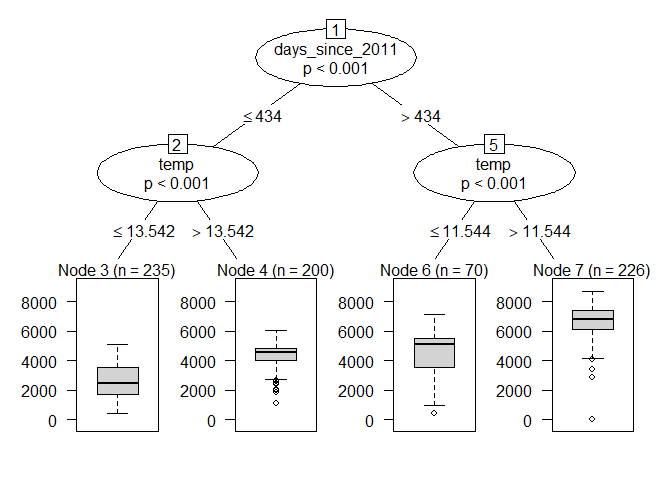

XAI 2: Interpretable models
================
Jose Giner

## EXERCISE 1:

From the COMPAS database extract the samples of black defendants (race
== “African-American”) and white defendants (race == “Caucasian”) as you
did in “Fairness2”. Remember to filter out rows where
days\_b\_screening\_arrest is over 30 or under -30, leaving us with less
than 6,200 samples.

Use the logistic regression model (**glm()**) to **predict recedivism**
of defendants considering that we set recividism prediction as those
whose **decile\_score is equal o greater than 4**. Use sex, age, race
and is\_recid as input features.

**Show the resulting weights, odds ratio and std error in a table.**

Finally, to facilitate the comparison of the odds ratio, build a bar
chart with the values for each input feature (discard Intercept in this
plot and order bars by odds\_ratio).

## QUESTIONS:

Interpret the results.

Based on the odds ratio displayed below, input feature `is_recid` has
the highest proportion and its p-value is below 0.05, telling us that is
significant and we can safely interpret the odds ratio. This can be
interpreted as average, that the odds of recidivism are three times
higher for recidivating defendants (`is_recid` = 1) than for non
recidivating defendants (calculated as the exponential of weight of the
feature). Because the odds ratio is greater than 1.0, offenders who
recidivated in the past are more likely to recidivate again and
`is_recid` is a potential feature for determining recidivism, also
observed in the magnitude of the odds ratio.

For `sexMale` predictor variable, the odds of recidivism for male
(`sexMale` = 1) are 6.4% higher than the odds for females (`sexMale` =
0). The fact that the odds ratio is close to 1, indicates that sex is
not quite associated with recidivism and therefore it is not significant
in the logistic model. This can be observed in its p value, which is
greater than 0.05.

The coefficient for `age` term says that we will see a 6% decrease in
the odds of recidivism for every year older the defendant becomes. In
this case, p-value is less than the predetermined cutoff and so it is
statistically significant. Although odds ratio (0.94) is again close to
1 and could argue that age is not associated with recidivism, we must
keep in mind that age is not a binary preditor and so significance
changes, in comparison with sex feature.

Finally, the summary of fitted model shows that the odds to recidivate
for caucasian race (`raceCaucasian` = 1) over the odds to recidivate for
african-american race (`raceCaucasian` = 0) is exp(-0.69) = 0.5. As this
value is less than 1, the odds of recidivism among white defendants are
half than the odds of recidivism among african-american defendants. This
suggests that race could be a risk factor for recidivism.

Mention that when describing the odds ratio of a certain term, we
suppose that the rest are held at fixed values.

``` r
library(dplyr)
library(plotly)
library(reshape2)
library(lubridate)
library(broom)

compas <- read.csv("compas-scores-two-years.csv")

#Filtering process
compas = compas %>%
  filter(days_b_screening_arrest > -30 & days_b_screening_arrest < 30) 

compas1 = subset(compas, (race == "Caucasian" | race == "African-American"))

Predicted_Score_4 <- cut(
  compas1$decile_score,
  breaks = c(0, 4, Inf),
  labels = c(0, 1),
  right  = FALSE
)

compas2 = compas1 %>% mutate(Predicted_Score_4) 

model <- glm(Predicted_Score_4 ~ sex + age + race + is_recid ,family = binomial ,data = compas2)
summary(model)
```

    ## 
    ## Call:
    ## glm(formula = Predicted_Score_4 ~ sex + age + race + is_recid, 
    ##     family = binomial, data = compas2)
    ## 
    ## Deviance Residuals: 
    ##     Min       1Q   Median       3Q      Max  
    ## -2.1160  -0.9915   0.5470   0.8728   2.3944  
    ## 
    ## Coefficients:
    ##                Estimate Std. Error z value Pr(>|z|)    
    ## (Intercept)    2.171337   0.125154  17.349   <2e-16 ***
    ## sexMale        0.062458   0.078830   0.792    0.428    
    ## age           -0.060401   0.002907 -20.775   <2e-16 ***
    ## raceCaucasian -0.692911   0.064278 -10.780   <2e-16 ***
    ## is_recid       1.100365   0.063839  17.236   <2e-16 ***
    ## ---
    ## Signif. codes:  0 '***' 0.001 '**' 0.01 '*' 0.05 '.' 0.1 ' ' 1
    ## 
    ## (Dispersion parameter for binomial family taken to be 1)
    ## 
    ##     Null deviance: 7136.2  on 5266  degrees of freedom
    ## Residual deviance: 5936.0  on 5262  degrees of freedom
    ## AIC: 5946
    ## 
    ## Number of Fisher Scoring iterations: 3

``` r
tid <- tidy(model)
tid = tid[,1:3]

tid$odds_ratio = exp(coef(model)) 


fig1 <- tid[2:5,] %>%
  plot_ly( x =~reorder(term,-odds_ratio)  , y =~ odds_ratio ) %>% add_bars() %>% layout(xaxis = list(title ="term")) 

fig1
```

<!--html_preserve-->

<div id="htmlwidget-bd4b8a21bda322ed8102" class="plotly html-widget" style="width:672px;height:480px;">

</div>

<script type="application/json" data-for="htmlwidget-bd4b8a21bda322ed8102">{"x":{"visdat":{"2360774c19b5":["function () ","plotlyVisDat"]},"cur_data":"2360774c19b5","attrs":{"2360774c19b5":{"x":{},"y":{},"alpha_stroke":1,"sizes":[10,100],"spans":[1,20],"type":"bar","inherit":true}},"layout":{"margin":{"b":40,"l":60,"t":25,"r":10},"xaxis":{"domain":[0,1],"automargin":true,"title":"term","type":"category","categoryorder":"array","categoryarray":["is_recid","sexMale","age","raceCaucasian"]},"yaxis":{"domain":[0,1],"automargin":true,"title":"odds_ratio"},"hovermode":"closest","showlegend":false},"source":"A","config":{"showSendToCloud":false},"data":[{"x":["sexMale","age","raceCaucasian","is_recid"],"y":[1.06444954105614,0.941386687924,0.500118210554204,3.00526264705839],"type":"bar","marker":{"color":"rgba(31,119,180,1)","line":{"color":"rgba(31,119,180,1)"}},"error_y":{"color":"rgba(31,119,180,1)"},"error_x":{"color":"rgba(31,119,180,1)"},"xaxis":"x","yaxis":"y","frame":null}],"highlight":{"on":"plotly_click","persistent":false,"dynamic":false,"selectize":false,"opacityDim":0.2,"selected":{"opacity":1},"debounce":0},"shinyEvents":["plotly_hover","plotly_click","plotly_selected","plotly_relayout","plotly_brushed","plotly_brushing","plotly_clickannotation","plotly_doubleclick","plotly_deselect","plotly_afterplot","plotly_sunburstclick"],"base_url":"https://plot.ly"},"evals":[],"jsHooks":[]}</script>

<!--/html_preserve-->

## EXERCISE 2:

Use the bike rental database of practice 3 (modified as we performed
there) to **build a regresion tree** using the function **ctree()** from
**library partykit** to **predict** the volume of bikes rented (**cnt**)
depending on the rest of features. To allow an easy explanation of the
results fix the **maximum depth to 2** and fix the **family** parameter
to **“binomial”**.

Plot the resulting tree using the **plot()** function.

## QUESTIONS:

Interpret the results.

In this case we have a regression tree with max depth of 2, evaluating 2
feature´s conditions (splits). A new individual can fall into one of 4
different subgroups (leaf nodes), according to its values on these
features. Lets say we are going to predict the bike rentals in a day
which is 600 days away from 1/1/2011 and the temperature registered that
day was 9 degrees Celsius. Based on the below tree, the first split
refering to days passed since 2011 is evaluated and the individual falls
into the right node (label 5) as a result. Then looking at the second
one, temperature is less that 11.54 degrees so it falls in the left leaf
node (label 6) and it is expected around 4000 bikes to be used that day,
although variance is quite high.

Overall, we must say that there is not a big difference in the average
number of rentals between each subgroup (observed through the boxplot
diagrams), although separation between nodes 3 and 7 is the most clear
because more bikes are going to be used in hot days further apart from
2011 than in the opposite case.

``` r
library(partykit)
```

    ## Warning: package 'partykit' was built under R version 4.0.3

    ## Loading required package: grid

    ## Loading required package: libcoin

    ## Warning: package 'libcoin' was built under R version 4.0.3

    ## Loading required package: mvtnorm

    ## Warning: package 'mvtnorm' was built under R version 4.0.3

``` r
days <- read.csv("C:\\Users\\Jose Giner\\OneDrive\\Documentos\\Asignaturas UPV\\Asignaturas Tercero\\EDM\\Practica 3 Sin sol\\Bike-Sharing-Dataset\\day.csv")
hour <- read.csv("C:\\Users\\Jose Giner\\OneDrive\\Documentos\\Asignaturas UPV\\Asignaturas Tercero\\EDM\\Practica 3 Sin sol\\Bike-Sharing-Dataset\\hour.csv")

days1 = days %>% mutate(MISTY = recode(weathersit, 
                         `1` = 0,
                         `2` = 1,
                         `3` = 0,
                         `4` = 0))

days2 = days1 %>% mutate(RAIN = recode(weathersit, 
                         `1` = 0,
                         `2` = 0,
                         `3` = 1,
                         `4` = 1))

days2$temp <- days2$temp *47 -8
days2$hum <- days2$hum*100
days2$windspeed <- days2$windspeed*67
days2$days_since_2011 =  as.numeric(as.Date(days2$dteday, format="%Y-%m-%d")-
                  as.Date(days2$dteday[1], format="%Y-%m-%d"))


for(unique_value in unique(days2$season)){
 
  days2[paste("season", unique_value, sep = ".")] <- ifelse(days2$season == unique_value, 1, 0)

}

names(days2)[names(days2) == "season.1"] <- "WINTER"
names(days2)[names(days2) == "season.3"] <- "SUMMER"
names(days2)[names(days2) == "season.4"] <- "FALL"


days_modelo = days2[,c("workingday","holiday","temp", "hum","windspeed","MISTY","RAIN","WINTER","SUMMER","FALL","days_since_2011","cnt")]

regTree = partykit::ctree(cnt ~ ., maxdepth = 2 , data = days_modelo)
summary(regTree)
```

    ##   Length Class      Mode
    ## 1 7      constparty list
    ## 2 3      constparty list
    ## 3 1      constparty list
    ## 4 1      constparty list
    ## 5 3      constparty list
    ## 6 1      constparty list
    ## 7 1      constparty list

``` r
plot(regTree)
```

<!-- -->

## EXERCISE 3:

Since RuleFit estimates a linear model in the end, the interpretation is
equivalent to linear models. The only difference is that the model has
new features that are coming from decision rules. Decision rules are
binary features: A value of 1 means that all conditions of the rule are
met, otherwise the value is 0. For linear terms in RuleFit, the
interpretation is the same as in linear regression models: If xj
increases by one unit,the predicted out come changes by βj.

Apply RuleFit (function **pre()** from **library pre**) the bike rental
database of practice 3 (modified as we performed there). **Read** the
paper **pre\_rule\_fit\_function.pdf** if you do not know how **to use
the pre()** function. To allow an easy explanation of the results fix
the **maximum depth to 2** and fix the **family** parameter to
**“gaussian”**.

**Obtain the coefficients** of the obtained rules and the importance of
each rule. **Remove** all the **rules** that have **0 coefficient**.

**Show** a table with the **4 top rules** ordered by importance.

Use **Plotly to draw** the **bar plot** that shows the **variable
importance**. The variable importance can be obtained from the output of
impotance() function (show bars in descending order of imp).

## QUESTIONS:

  - How many rules have you obtained initially?
  - How many rules have you obtained after removing the ones with 0
    coefficient?
  - Interpret the results of the top 4 rules and the variable importance
    plot.

In our case, the most significant rules are those displayed below. In
first place we have the tree whose decision rules are if temperature is
less than or equal to 29.3 degrees and greater than 11.6 degrees. From
this rule´s coefficient, we can interpret that days with registered
temperature between these values have in average 559 more bikes than the
rest of days (given that rest features stay the same). The fact that we
are making splits using the same and most important input feature (based
on the variable importance plot), tells us that this rule has a big
impact in testing bike rentals.

For the second rule a similar thing happens as we are determining
subgroups based on an important variable as it is the days passed since
2011. From the importance plot, we can see it has a value a bit lower
than temperature, but in comparison with the rest, both are the most
determinant for creating these rules. Based on this rule’s weight, a day
between 369 and 714 days apart from 1/1/2011 will have in average 418
bikes more than the rest days (at fixed values for rest of variables).

The next rule specifies that days belonging to a season different to
winter, with a windspeed of less than 23.4 units, will register in
average, 174 bike rentals more in comparison with days that do not
satisfy these conditions.

The fourth rule says that days with temperature greater than 5.7
degrees, with more than one year apart from the release date or first
entry registered, will have in average 130 more bikes predicted than
days that do not satisfy these conditions.

Finally, from the variable importance plot, as said before, temperature
and days since 2011, are the key predictors to determine bike rentals,
but there are also some other variables to highlight such as humidity,
windspeed or if it rained at that day (RAIN).

``` r
library(pre)
```

    ## Warning: package 'pre' was built under R version 4.0.4

    ## 
    ## Attaching package: 'pre'

    ## The following object is masked from 'package:dplyr':
    ## 
    ##     explain

``` r
set.seed(42)  # for reproducibility
ruleFit = pre(cnt~. , maxdepth = 2, data = days_modelo, family = 'gaussian')
ruleFit
```

    ## 
    ## Final ensemble with cv error within 1se of minimum: 
    ##   lambda =  15.19634
    ##   number of terms = 74
    ##   mean cv error (se) = 391715.4 (38412.47)
    ## 
    ##   cv error type : Mean-Squared Error
    ## 
    ##          rule   coefficient                                     description
    ##   (Intercept)  1636.0105656                                               1
    ##          RAIN  -613.2361014                                  0 <= RAIN <= 1
    ##      rule1112   559.5945401            temp <= 29.325849 & temp > 11.583349
    ##       rule929   417.9685838  days_since_2011 <= 714 & days_since_2011 > 368
    ##      rule1037   396.2011528             windspeed <= 23.39171 & WINTER <= 0
    ##       rule787   263.6195302         temp > 5.732178 & days_since_2011 > 365
    ##       rule763   256.3200088  days_since_2011 > 109 & windspeed <= 23.292014
    ##      rule1221   249.7005334                 temp > 15.6175 & hum <= 84.4167
    ##       rule563  -247.9718975             temp <= 11.544151 & workingday <= 0
    ##      rule1292   240.8480303                     temp > 9.703349 & RAIN <= 0
    ##       rule783   231.0929943                         RAIN <= 0 & temp > 5.16
    ##      rule1152   219.5946697          hum <= 70.4167 & days_since_2011 > 366
    ##      rule1303   206.1986801         temp > 9.664151 & days_since_2011 > 597
    ##       rule892   199.3420447          days_since_2011 > 368 & hum <= 81.0417
    ##      rule1306  -189.7460756           hum > 64.9565 & windspeed > 12.875725
    ##       rule308   178.2440144          days_since_2011 > 429 & hum <= 76.5833
    ##        rule63   173.0420284         temp > 8.184356 & days_since_2011 > 431
    ##       rule853   168.9054388                         temp > 4.22 & RAIN <= 0
    ##      rule1128   162.0489197                       hum <= 81.0833 & FALL > 0
    ##       rule173   157.4478874         days_since_2011 > 429 & temp > 5.081651
    ##       rule523   152.6764746          days_since_2011 > 111 & hum <= 74.2083
    ##      rule1074  -151.9248389                windspeed > 9.000914 & MISTY > 0
    ##       rule349   143.4911850             days_since_2011 > 111 & WINTER <= 0
    ##       rule777   135.3067977        windspeed <= 17.542007 & temp > 3.906651
    ##       holiday  -123.4876804                               0 <= holiday <= 1
    ##      rule1001   -98.2333258              hum > 68.4167 & windspeed > 8.7502
    ##       rule382    95.1876505        temp > 13.228349 & days_since_2011 > 554
    ##       rule740    92.6781782                     temp > 9.664151 & hum <= 87
    ##       rule336   -88.9030621                                 temp <= 16.0875
    ##      rule1098    88.2099290           holiday <= 0 & windspeed <= 19.083811
    ##       rule750    86.8221555          temp > 16.0875 & days_since_2011 > 614
    ##       rule914    84.0239773                         RAIN <= 0 & temp > 7.98
    ##      rule1162    81.5739991             MISTY <= 0 & days_since_2011 <= 683
    ##       rule302    72.6896476               days_since_2011 > 111 & RAIN <= 0
    ##      rule1273   -72.6648142            hum > 67.625 & windspeed > 10.250464
    ##       rule248   -71.2790755                               temp <= 15.774151
    ##       rule455    70.0844296        temp > 13.815849 & days_since_2011 > 436
    ##       rule465    65.3636007  days_since_2011 > 387 & windspeed <= 19.083811
    ##       rule648    62.5720646              days_since_2011 > 365 & MISTY <= 0
    ##      rule1013   -62.4492756           hum > 73.4583 & windspeed > 10.416825
    ##       rule631    62.1051886                    WINTER <= 0 & hum <= 77.0417
    ##       rule257   -61.3975719                                   temp <= 14.09
    ##      rule1086    58.8572373   windspeed <= 8.375536 & days_since_2011 > 150
    ##       rule760    52.8352429  windspeed <= 20.125996 & days_since_2011 > 564
    ##       rule525    42.9912796                    WINTER <= 0 & hum <= 81.0417
    ##      rule1235    41.1171063           windspeed <= 23.999132 & holiday <= 0
    ##      rule1318    40.4405905          hum <= 76.5833 & days_since_2011 > 380
    ##       rule213    37.7268792         temp > 8.184356 & days_since_2011 > 440
    ##       rule330    37.3371214             days_since_2011 > 111 & temp > 5.16
    ##       rule597    36.8836064              days_since_2011 > 387 & MISTY <= 0
    ##      rule1240   -33.7270591         workingday > 0 & days_since_2011 <= 556
    ##       rule691    31.1913713         temp > 8.184356 & days_since_2011 > 364
    ##       rule486    30.0084561          days_since_2011 > 421 & hum <= 76.4167
    ##      rule1018    28.2864924  windspeed <= 23.304945 & days_since_2011 > 380
    ##       rule733    27.4913565          days_since_2011 > 109 & hum <= 75.6667
    ##       rule991    27.3797441          hum <= 77.0417 & days_since_2011 > 368
    ##       rule814    24.7849986  days_since_2011 > 381 & windspeed <= 19.458743
    ##       rule808    23.9605236                    WINTER <= 0 & hum <= 70.4167
    ##      rule1028   -23.7897318                                 temp <= 15.8525
    ##      rule1042    23.5349537         hum <= 70.3333 & days_since_2011 <= 686
    ##       rule769   -20.4396869              temp <= 7.121733 & workingday <= 0
    ##       rule795    20.0414097  windspeed <= 21.083225 & days_since_2011 > 567
    ##      rule1241    19.4240070          workingday > 0 & days_since_2011 > 556
    ##       rule910   -18.3505139         temp <= 15.774151 & windspeed > 7.12545
    ##       rule346    17.6346062        temp > 12.758349 & days_since_2011 > 500
    ##       rule514    -8.4654391                               temp <= 16.518349
    ##       rule639     7.5758110           days_since_2011 > 111 & hum <= 82.125
    ##       rule906     4.8509456              MISTY <= 0 & days_since_2011 > 366
    ##       rule148     3.3239457          days_since_2011 > 430 & temp > 15.6175
    ##      rule1124     2.7382516          windspeed > 12.584007 & hum <= 64.9565
    ##      rule1140     1.6620384            holiday <= 0 & windspeed <= 23.39171
    ##       rule932     0.9842741  windspeed <= 19.000061 & days_since_2011 > 386
    ##       rule585     0.3416324            days_since_2011 > 429 & hum <= 76.75
    ##      rule1143     0.3228033              MISTY <= 0 & days_since_2011 > 364
    ##       rule340     0.2429191          temp > 16.0875 & days_since_2011 > 432

``` r
coefficients = coef(ruleFit)

coefficients_0 =  coefficients %>% filter(coefficient != 0)

imps = importance(ruleFit)
```

<!-- -->

``` r
imps$baseimps[1:4, ]
```

    ##       rule                                    description      imp coefficient
    ## 1 rule1112           temp <= 29.325849 & temp > 11.583349 275.1728    559.5945
    ## 2  rule929 days_since_2011 <= 714 & days_since_2011 > 368 208.8295    417.9686
    ## 3 rule1037            windspeed <= 23.39171 & WINTER <= 0 174.4780    396.2012
    ## 4  rule787        temp > 5.732178 & days_since_2011 > 365 130.5322    263.6195
    ##          sd
    ## 1 0.4917360
    ## 2 0.4996298
    ## 3 0.4403773
    ## 4 0.4951539

``` r
fig2 <- tid[2:5,] %>%
  plot_ly( x =~reorder(term,-odds_ratio)  , y =~ odds_ratio ) %>% add_bars() %>% layout(xaxis = list(title ="term")) 


fig2 = imps$varimps %>% 
  plot_ly( x =~reorder(varname,-imp)  , y =~ imp ) %>% add_bars() %>% layout(xaxis = list(title ="varname")) 

fig2
```

<!--html_preserve-->

<div id="htmlwidget-4a3c0c3dc1424e5d2cef" class="plotly html-widget" style="width:672px;height:480px;">

</div>

<script type="application/json" data-for="htmlwidget-4a3c0c3dc1424e5d2cef">{"x":{"visdat":{"2360e97575e":["function () ","plotlyVisDat"]},"cur_data":"2360e97575e","attrs":{"2360e97575e":{"x":{},"y":{},"alpha_stroke":1,"sizes":[10,100],"spans":[1,20],"type":"bar","inherit":true}},"layout":{"margin":{"b":40,"l":60,"t":25,"r":10},"xaxis":{"domain":[0,1],"automargin":true,"title":"varname","type":"category","categoryorder":"array","categoryarray":["temp","days_since_2011","hum","windspeed","RAIN","WINTER","MISTY","workingday","holiday","FALL"]},"yaxis":{"domain":[0,1],"automargin":true,"title":"imp"},"hovermode":"closest","showlegend":false},"source":"A","config":{"showSendToCloud":false},"data":[{"x":["temp","days_since_2011","hum","windspeed","RAIN","WINTER","MISTY","workingday","holiday","FALL"],"y":[960.102581797715,884.414761930315,450.544760243577,361.863404715232,262.351495044998,151.093800339397,76.8631896794749,57.1477404225941,41.2304630395882,32.6625924941001],"type":"bar","marker":{"color":"rgba(31,119,180,1)","line":{"color":"rgba(31,119,180,1)"}},"error_y":{"color":"rgba(31,119,180,1)"},"error_x":{"color":"rgba(31,119,180,1)"},"xaxis":"x","yaxis":"y","frame":null}],"highlight":{"on":"plotly_click","persistent":false,"dynamic":false,"selectize":false,"opacityDim":0.2,"selected":{"opacity":1},"debounce":0},"shinyEvents":["plotly_hover","plotly_click","plotly_selected","plotly_relayout","plotly_brushed","plotly_brushing","plotly_clickannotation","plotly_doubleclick","plotly_deselect","plotly_afterplot","plotly_sunburstclick"],"base_url":"https://plot.ly"},"evals":[],"jsHooks":[]}</script>

<!--/html_preserve-->

``` r
print(paste0("Number of rules: ", nrow(coefficients)))
```

    ## [1] "Number of rules: 1222"

``` r
print(paste0("Number of rules without 0 coefficient: ",  nrow(coefficients_0)))
```

    ## [1] "Number of rules without 0 coefficient: 75"
