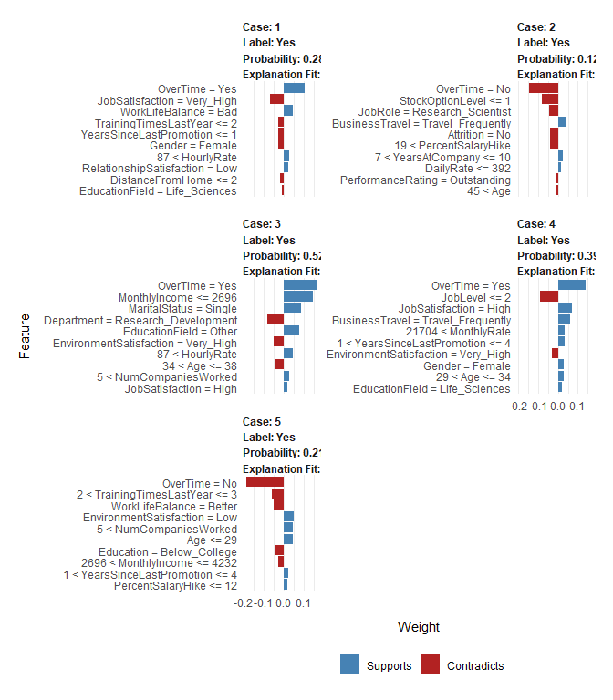

XAI 4: Model-Agnostic methods 2
================
Jose Giner

## EXERCISE:

In this first exercise we will use the **pdp library**. The pdp package
is useful for constructing PDPs for many classes of fitted models in R.
PDPs are especially useful for visualizing the relationships discovered
by complex machine learning algorithms such as a random forest. The most
important functions are: **partial(), plotPartial()** and
**autoplot()**.

At the end of this exercise (or along it) read **pdp\_ An R Package for
Constructing Partial Dependence Plots • pdp.pdf** to understand all the
potentiality of this package.

ATTENTION: Follow the instructions on the practice bulletin to perform
this exercise.

In the next chunck, visualize the contribution of features
“MonthlyIncome”, “OverTime”, “Age” and “DailyRate” to the probability
of attrition of the employee.

``` r
library(modeldata)
library(caret)
library(pdp)
library(vip)
library(dplyr)
library(ggplot2)
library(plotly)
library(lime)

data("attrition")
df <- attrition
df = df %>% mutate(Attrition = factor(Attrition, levels = c("Yes","No")))

index = 1:5
train_obs = df[-index,]
local_obs = df[index,]

set.seed(1507)
model.fit = train(Attrition ~., data = train_obs, method = 'ranger', trControl = trainControl(method = 'cv', number = 5, classProbs = TRUE), tuneLength = 1, importance = 'impurity')

vip(model.fit) + ggtitle("Feature Importance")
```

<!-- --> Starting up
with the global interpretation through the variable importance plot in
our model, we can see that `MonthlyIncome` is highly associated with the
attrition probabilities of the employees (max importance). The other
features we will focus on are `Overtime`, `Age` and `DailyRate`, as they
also seem to contribute quite well. To undersand these associations, we
must look at the partial dependence plots to get an idea of how those
variables change the predictions while changing its own range of values.

``` r
p1 = partial(model.fit, pred.var = 'MonthlyIncome', plot = TRUE, rug = TRUE, plot.engine = 'ggplot2', prob = TRUE)
p2 = partial(model.fit, pred.var = 'OverTime', plot = TRUE, rug = TRUE, plot.engine = 'ggplot2', prob = TRUE)
p3 = partial(model.fit, pred.var = 'Age', plot = TRUE, rug = TRUE, plot.engine = 'ggplot2', prob = TRUE)
p4 = partial(model.fit, pred.var = 'DailyRate', plot = TRUE, rug = TRUE, plot.engine = 'ggplot2', prob = TRUE)

subplot(p1,p2,p3,p4, titleX = TRUE)
```

<!--html_preserve-->

<div id="htmlwidget-64662657af266fc56e67" class="plotly html-widget" style="width:672px;height:480px;">

</div>

<script type="application/json" data-for="htmlwidget-64662657af266fc56e67">{"x":{"data":[{"x":[1009,1388,1768,2148,2528,2908,3287,3667,4047,4427,4807,5186,5566,5946,6326,6706,7085,7465,7845,8225,8605,8984,9364,9744,10124,10504,10883,11263,11643,12023,12403,12782,13162,13542,13922,14302,14681,15061,15441,15821,16201,16580,16960,17340,17720,18100,18479,18859,19239,19619,19999],"y":[0.298152901023891,0.293239590443686,0.278382252559727,0.22499385665529,0.194786348122867,0.17517133105802,0.165735153583618,0.160255290102389,0.151684641638225,0.149631399317406,0.150118771331058,0.15001228668942,0.149089419795222,0.149273720136519,0.149063481228669,0.151346075085324,0.150555631399317,0.151978156996587,0.153242320819113,0.153660068259386,0.153537201365188,0.154757679180887,0.156556996587031,0.158980204778157,0.159270989761092,0.156677133105802,0.155268259385666,0.15519590443686,0.155354266211604,0.154243003412969,0.153412969283276,0.153168600682594,0.152790443686007,0.152531058020478,0.152440955631399,0.152215699658703,0.152176109215017,0.152154266211604,0.152174744027304,0.152086006825939,0.152058703071672,0.152036860068259,0.152116040955631,0.152192491467577,0.152192491467577,0.152390443686007,0.152405460750853,0.153025255972696,0.154476450511945,0.159201365187713,0.204670307167235],"text":["object[[1L]]:  1009<br />object[[\"yhat\"]]: 0.2981529","object[[1L]]:  1388<br />object[[\"yhat\"]]: 0.2932396","object[[1L]]:  1768<br />object[[\"yhat\"]]: 0.2783823","object[[1L]]:  2148<br />object[[\"yhat\"]]: 0.2249939","object[[1L]]:  2528<br />object[[\"yhat\"]]: 0.1947863","object[[1L]]:  2908<br />object[[\"yhat\"]]: 0.1751713","object[[1L]]:  3287<br />object[[\"yhat\"]]: 0.1657352","object[[1L]]:  3667<br />object[[\"yhat\"]]: 0.1602553","object[[1L]]:  4047<br />object[[\"yhat\"]]: 0.1516846","object[[1L]]:  4427<br />object[[\"yhat\"]]: 0.1496314","object[[1L]]:  4807<br />object[[\"yhat\"]]: 0.1501188","object[[1L]]:  5186<br />object[[\"yhat\"]]: 0.1500123","object[[1L]]:  5566<br />object[[\"yhat\"]]: 0.1490894","object[[1L]]:  5946<br />object[[\"yhat\"]]: 0.1492737","object[[1L]]:  6326<br />object[[\"yhat\"]]: 0.1490635","object[[1L]]:  6706<br />object[[\"yhat\"]]: 0.1513461","object[[1L]]:  7085<br />object[[\"yhat\"]]: 0.1505556","object[[1L]]:  7465<br />object[[\"yhat\"]]: 0.1519782","object[[1L]]:  7845<br />object[[\"yhat\"]]: 0.1532423","object[[1L]]:  8225<br />object[[\"yhat\"]]: 0.1536601","object[[1L]]:  8605<br />object[[\"yhat\"]]: 0.1535372","object[[1L]]:  8984<br />object[[\"yhat\"]]: 0.1547577","object[[1L]]:  9364<br />object[[\"yhat\"]]: 0.1565570","object[[1L]]:  9744<br />object[[\"yhat\"]]: 0.1589802","object[[1L]]: 10124<br />object[[\"yhat\"]]: 0.1592710","object[[1L]]: 10504<br />object[[\"yhat\"]]: 0.1566771","object[[1L]]: 10883<br />object[[\"yhat\"]]: 0.1552683","object[[1L]]: 11263<br />object[[\"yhat\"]]: 0.1551959","object[[1L]]: 11643<br />object[[\"yhat\"]]: 0.1553543","object[[1L]]: 12023<br />object[[\"yhat\"]]: 0.1542430","object[[1L]]: 12403<br />object[[\"yhat\"]]: 0.1534130","object[[1L]]: 12782<br />object[[\"yhat\"]]: 0.1531686","object[[1L]]: 13162<br />object[[\"yhat\"]]: 0.1527904","object[[1L]]: 13542<br />object[[\"yhat\"]]: 0.1525311","object[[1L]]: 13922<br />object[[\"yhat\"]]: 0.1524410","object[[1L]]: 14302<br />object[[\"yhat\"]]: 0.1522157","object[[1L]]: 14681<br />object[[\"yhat\"]]: 0.1521761","object[[1L]]: 15061<br />object[[\"yhat\"]]: 0.1521543","object[[1L]]: 15441<br />object[[\"yhat\"]]: 0.1521747","object[[1L]]: 15821<br />object[[\"yhat\"]]: 0.1520860","object[[1L]]: 16201<br />object[[\"yhat\"]]: 0.1520587","object[[1L]]: 16580<br />object[[\"yhat\"]]: 0.1520369","object[[1L]]: 16960<br />object[[\"yhat\"]]: 0.1521160","object[[1L]]: 17340<br />object[[\"yhat\"]]: 0.1521925","object[[1L]]: 17720<br />object[[\"yhat\"]]: 0.1521925","object[[1L]]: 18100<br />object[[\"yhat\"]]: 0.1523904","object[[1L]]: 18479<br />object[[\"yhat\"]]: 0.1524055","object[[1L]]: 18859<br />object[[\"yhat\"]]: 0.1530253","object[[1L]]: 19239<br />object[[\"yhat\"]]: 0.1544765","object[[1L]]: 19619<br />object[[\"yhat\"]]: 0.1592014","object[[1L]]: 19999<br />object[[\"yhat\"]]: 0.2046703"],"type":"scatter","mode":"lines","line":{"width":1.88976377952756,"color":"rgba(0,0,0,1)","dash":"solid"},"hoveron":"points","showlegend":false,"xaxis":"x","yaxis":"y","hoverinfo":"text","frame":null},{"x":[1009,1009,null,2318.4,2318.4,null,2695.8,2695.8,null,3323,3323,null,4231.8,4231.8,null,4930,4930,null,5744.4,5744.4,null,6921.8,6921.8,null,9884.8,9884.8,null,13803.6,13803.6,null,19999,19999],"y":[0.141609010238908,0.14652896109215,null,0.141609010238908,0.14652896109215,null,0.141609010238908,0.14652896109215,null,0.141609010238908,0.14652896109215,null,0.141609010238908,0.14652896109215,null,0.141609010238908,0.14652896109215,null,0.141609010238908,0.14652896109215,null,0.141609010238908,0.14652896109215,null,0.141609010238908,0.14652896109215,null,0.141609010238908,0.14652896109215,null,0.141609010238908,0.14652896109215],"text":["x.rug[[1L]]:  1009.0","x.rug[[1L]]:  1009.0",null,"x.rug[[1L]]:  2318.4","x.rug[[1L]]:  2318.4",null,"x.rug[[1L]]:  2695.8","x.rug[[1L]]:  2695.8",null,"x.rug[[1L]]:  3323.0","x.rug[[1L]]:  3323.0",null,"x.rug[[1L]]:  4231.8","x.rug[[1L]]:  4231.8",null,"x.rug[[1L]]:  4930.0","x.rug[[1L]]:  4930.0",null,"x.rug[[1L]]:  5744.4","x.rug[[1L]]:  5744.4",null,"x.rug[[1L]]:  6921.8","x.rug[[1L]]:  6921.8",null,"x.rug[[1L]]:  9884.8","x.rug[[1L]]:  9884.8",null,"x.rug[[1L]]: 13803.6","x.rug[[1L]]: 13803.6",null,"x.rug[[1L]]: 19999.0","x.rug[[1L]]: 19999.0"],"type":"scatter","mode":"lines","line":{"width":1.88976377952756,"color":"rgba(0,0,0,1)","dash":"solid"},"hoveron":"points","showlegend":false,"xaxis":"x","yaxis":"y","hoverinfo":"text","frame":null},{"x":[1,2],"y":[0.125051194539249,0.277838907849829],"text":["object[[1L]]: No<br />object[[\"yhat\"]]: 0.1250512","object[[1L]]: Yes<br />object[[\"yhat\"]]: 0.2778389"],"type":"scatter","mode":"markers","marker":{"autocolorscale":false,"color":"rgba(0,0,0,1)","opacity":1,"size":5.66929133858268,"symbol":"circle","line":{"width":1.88976377952756,"color":"rgba(0,0,0,1)"}},"hoveron":"points","showlegend":false,"xaxis":"x2","yaxis":"y2","hoverinfo":"text","frame":null},{"x":[18,19,20,21,22,23,24,25,26,27,28,29,30,31,32,33,34,35,36,37,38,39,40,41,42,43,44,45,46,47,48,49,50,51,52,53,54,55,56,57,58,59,60],"y":[0.270632081911263,0.270109215017065,0.269567235494881,0.265359726962457,0.254025938566553,0.234462798634812,0.212488737201365,0.207886689419795,0.203542662116041,0.191772013651877,0.191115358361775,0.188761774744027,0.184767235494881,0.183234129692833,0.175621843003413,0.169590443686007,0.155650511945392,0.149878498293515,0.14620614334471,0.144298976109215,0.14381843003413,0.143500341296928,0.142916040955631,0.142862798634812,0.142752218430034,0.143302389078498,0.147227303754266,0.147000682593857,0.154956996587031,0.154667576791809,0.155474402730375,0.157728327645051,0.159601365187713,0.160731740614334,0.163283276450512,0.163635494880546,0.165976791808874,0.172335836177474,0.178305802047782,0.179447098976109,0.184251194539249,0.183460750853242,0.183460750853242],"text":["object[[1L]]: 18<br />object[[\"yhat\"]]: 0.2706321","object[[1L]]: 19<br />object[[\"yhat\"]]: 0.2701092","object[[1L]]: 20<br />object[[\"yhat\"]]: 0.2695672","object[[1L]]: 21<br />object[[\"yhat\"]]: 0.2653597","object[[1L]]: 22<br />object[[\"yhat\"]]: 0.2540259","object[[1L]]: 23<br />object[[\"yhat\"]]: 0.2344628","object[[1L]]: 24<br />object[[\"yhat\"]]: 0.2124887","object[[1L]]: 25<br />object[[\"yhat\"]]: 0.2078867","object[[1L]]: 26<br />object[[\"yhat\"]]: 0.2035427","object[[1L]]: 27<br />object[[\"yhat\"]]: 0.1917720","object[[1L]]: 28<br />object[[\"yhat\"]]: 0.1911154","object[[1L]]: 29<br />object[[\"yhat\"]]: 0.1887618","object[[1L]]: 30<br />object[[\"yhat\"]]: 0.1847672","object[[1L]]: 31<br />object[[\"yhat\"]]: 0.1832341","object[[1L]]: 32<br />object[[\"yhat\"]]: 0.1756218","object[[1L]]: 33<br />object[[\"yhat\"]]: 0.1695904","object[[1L]]: 34<br />object[[\"yhat\"]]: 0.1556505","object[[1L]]: 35<br />object[[\"yhat\"]]: 0.1498785","object[[1L]]: 36<br />object[[\"yhat\"]]: 0.1462061","object[[1L]]: 37<br />object[[\"yhat\"]]: 0.1442990","object[[1L]]: 38<br />object[[\"yhat\"]]: 0.1438184","object[[1L]]: 39<br />object[[\"yhat\"]]: 0.1435003","object[[1L]]: 40<br />object[[\"yhat\"]]: 0.1429160","object[[1L]]: 41<br />object[[\"yhat\"]]: 0.1428628","object[[1L]]: 42<br />object[[\"yhat\"]]: 0.1427522","object[[1L]]: 43<br />object[[\"yhat\"]]: 0.1433024","object[[1L]]: 44<br />object[[\"yhat\"]]: 0.1472273","object[[1L]]: 45<br />object[[\"yhat\"]]: 0.1470007","object[[1L]]: 46<br />object[[\"yhat\"]]: 0.1549570","object[[1L]]: 47<br />object[[\"yhat\"]]: 0.1546676","object[[1L]]: 48<br />object[[\"yhat\"]]: 0.1554744","object[[1L]]: 49<br />object[[\"yhat\"]]: 0.1577283","object[[1L]]: 50<br />object[[\"yhat\"]]: 0.1596014","object[[1L]]: 51<br />object[[\"yhat\"]]: 0.1607317","object[[1L]]: 52<br />object[[\"yhat\"]]: 0.1632833","object[[1L]]: 53<br />object[[\"yhat\"]]: 0.1636355","object[[1L]]: 54<br />object[[\"yhat\"]]: 0.1659768","object[[1L]]: 55<br />object[[\"yhat\"]]: 0.1723358","object[[1L]]: 56<br />object[[\"yhat\"]]: 0.1783058","object[[1L]]: 57<br />object[[\"yhat\"]]: 0.1794471","object[[1L]]: 58<br />object[[\"yhat\"]]: 0.1842512","object[[1L]]: 59<br />object[[\"yhat\"]]: 0.1834608","object[[1L]]: 60<br />object[[\"yhat\"]]: 0.1834608"],"type":"scatter","mode":"lines","line":{"width":1.88976377952756,"color":"rgba(0,0,0,1)","dash":"solid"},"hoveron":"points","showlegend":false,"xaxis":"x3","yaxis":"y3","hoverinfo":"text","frame":null},{"x":[18,18,null,26,26,null,29,29,null,31,31,null,34,34,null,36,36,null,38,38,null,41,41,null,45,45,null,50,50,null,60,60],"y":[0.136358225255973,0.140578260750853,null,0.136358225255973,0.140578260750853,null,0.136358225255973,0.140578260750853,null,0.136358225255973,0.140578260750853,null,0.136358225255973,0.140578260750853,null,0.136358225255973,0.140578260750853,null,0.136358225255973,0.140578260750853,null,0.136358225255973,0.140578260750853,null,0.136358225255973,0.140578260750853,null,0.136358225255973,0.140578260750853,null,0.136358225255973,0.140578260750853],"text":["x.rug[[1L]]: 18","x.rug[[1L]]: 18",null,"x.rug[[1L]]: 26","x.rug[[1L]]: 26",null,"x.rug[[1L]]: 29","x.rug[[1L]]: 29",null,"x.rug[[1L]]: 31","x.rug[[1L]]: 31",null,"x.rug[[1L]]: 34","x.rug[[1L]]: 34",null,"x.rug[[1L]]: 36","x.rug[[1L]]: 36",null,"x.rug[[1L]]: 38","x.rug[[1L]]: 38",null,"x.rug[[1L]]: 41","x.rug[[1L]]: 41",null,"x.rug[[1L]]: 45","x.rug[[1L]]: 45",null,"x.rug[[1L]]: 50","x.rug[[1L]]: 50",null,"x.rug[[1L]]: 60","x.rug[[1L]]: 60"],"type":"scatter","mode":"lines","line":{"width":1.88976377952756,"color":"rgba(0,0,0,1)","dash":"solid"},"hoveron":"points","showlegend":false,"xaxis":"x3","yaxis":"y3","hoverinfo":"text","frame":null},{"x":[102,129,157,185,213,241,269,297,325,353,381,409,437,465,493,521,549,576,604,632,660,688,716,744,772,800,828,856,884,912,940,968,996,1024,1051,1079,1107,1135,1163,1191,1219,1247,1275,1303,1331,1359,1387,1415,1443,1471,1499],"y":[0.234266211604096,0.193127645051195,0.182279863481229,0.180662116040956,0.180558361774744,0.181376109215017,0.178137883959044,0.177141296928328,0.175792491467577,0.174911945392491,0.173399317406143,0.171833447098976,0.169081228668942,0.16681638225256,0.165892150170648,0.165436177474403,0.164481911262799,0.163982252559727,0.163867576791809,0.16380204778157,0.16440819112628,0.162761774744027,0.162196587030717,0.162162457337884,0.160313993174061,0.159967235494881,0.160659385665529,0.159582252559727,0.160623890784983,0.158839590443686,0.157365187713311,0.156870989761092,0.1560204778157,0.155731058020478,0.155518088737201,0.15581843003413,0.154875085324232,0.153672354948805,0.153429351535836,0.153301023890785,0.153146757679181,0.153369283276451,0.153990443686007,0.154305802047782,0.154599317406143,0.158678498293515,0.159714675767918,0.164320819112628,0.170991126279863,0.185004778156997,0.210967918088737],"text":["object[[1L]]:  102<br />object[[\"yhat\"]]: 0.2342662","object[[1L]]:  129<br />object[[\"yhat\"]]: 0.1931276","object[[1L]]:  157<br />object[[\"yhat\"]]: 0.1822799","object[[1L]]:  185<br />object[[\"yhat\"]]: 0.1806621","object[[1L]]:  213<br />object[[\"yhat\"]]: 0.1805584","object[[1L]]:  241<br />object[[\"yhat\"]]: 0.1813761","object[[1L]]:  269<br />object[[\"yhat\"]]: 0.1781379","object[[1L]]:  297<br />object[[\"yhat\"]]: 0.1771413","object[[1L]]:  325<br />object[[\"yhat\"]]: 0.1757925","object[[1L]]:  353<br />object[[\"yhat\"]]: 0.1749119","object[[1L]]:  381<br />object[[\"yhat\"]]: 0.1733993","object[[1L]]:  409<br />object[[\"yhat\"]]: 0.1718334","object[[1L]]:  437<br />object[[\"yhat\"]]: 0.1690812","object[[1L]]:  465<br />object[[\"yhat\"]]: 0.1668164","object[[1L]]:  493<br />object[[\"yhat\"]]: 0.1658922","object[[1L]]:  521<br />object[[\"yhat\"]]: 0.1654362","object[[1L]]:  549<br />object[[\"yhat\"]]: 0.1644819","object[[1L]]:  576<br />object[[\"yhat\"]]: 0.1639823","object[[1L]]:  604<br />object[[\"yhat\"]]: 0.1638676","object[[1L]]:  632<br />object[[\"yhat\"]]: 0.1638020","object[[1L]]:  660<br />object[[\"yhat\"]]: 0.1644082","object[[1L]]:  688<br />object[[\"yhat\"]]: 0.1627618","object[[1L]]:  716<br />object[[\"yhat\"]]: 0.1621966","object[[1L]]:  744<br />object[[\"yhat\"]]: 0.1621625","object[[1L]]:  772<br />object[[\"yhat\"]]: 0.1603140","object[[1L]]:  800<br />object[[\"yhat\"]]: 0.1599672","object[[1L]]:  828<br />object[[\"yhat\"]]: 0.1606594","object[[1L]]:  856<br />object[[\"yhat\"]]: 0.1595823","object[[1L]]:  884<br />object[[\"yhat\"]]: 0.1606239","object[[1L]]:  912<br />object[[\"yhat\"]]: 0.1588396","object[[1L]]:  940<br />object[[\"yhat\"]]: 0.1573652","object[[1L]]:  968<br />object[[\"yhat\"]]: 0.1568710","object[[1L]]:  996<br />object[[\"yhat\"]]: 0.1560205","object[[1L]]: 1024<br />object[[\"yhat\"]]: 0.1557311","object[[1L]]: 1051<br />object[[\"yhat\"]]: 0.1555181","object[[1L]]: 1079<br />object[[\"yhat\"]]: 0.1558184","object[[1L]]: 1107<br />object[[\"yhat\"]]: 0.1548751","object[[1L]]: 1135<br />object[[\"yhat\"]]: 0.1536724","object[[1L]]: 1163<br />object[[\"yhat\"]]: 0.1534294","object[[1L]]: 1191<br />object[[\"yhat\"]]: 0.1533010","object[[1L]]: 1219<br />object[[\"yhat\"]]: 0.1531468","object[[1L]]: 1247<br />object[[\"yhat\"]]: 0.1533693","object[[1L]]: 1275<br />object[[\"yhat\"]]: 0.1539904","object[[1L]]: 1303<br />object[[\"yhat\"]]: 0.1543058","object[[1L]]: 1331<br />object[[\"yhat\"]]: 0.1545993","object[[1L]]: 1359<br />object[[\"yhat\"]]: 0.1586785","object[[1L]]: 1387<br />object[[\"yhat\"]]: 0.1597147","object[[1L]]: 1415<br />object[[\"yhat\"]]: 0.1643208","object[[1L]]: 1443<br />object[[\"yhat\"]]: 0.1709911","object[[1L]]: 1471<br />object[[\"yhat\"]]: 0.1850048","object[[1L]]: 1499<br />object[[\"yhat\"]]: 0.2109679"],"type":"scatter","mode":"lines","line":{"width":1.88976377952756,"color":"rgba(0,0,0,1)","dash":"solid"},"hoveron":"points","showlegend":false,"xaxis":"x4","yaxis":"y4","hoverinfo":"text","frame":null},{"x":[102,102,null,241.8,241.8,null,391.8,391.8,null,530.2,530.2,null,656.2,656.2,null,802,802,null,942,942,null,1093,1093,null,1224,1224,null,1355,1355,null,1499,1499],"y":[0.149090784982935,0.151767726962457,null,0.149090784982935,0.151767726962457,null,0.149090784982935,0.151767726962457,null,0.149090784982935,0.151767726962457,null,0.149090784982935,0.151767726962457,null,0.149090784982935,0.151767726962457,null,0.149090784982935,0.151767726962457,null,0.149090784982935,0.151767726962457,null,0.149090784982935,0.151767726962457,null,0.149090784982935,0.151767726962457,null,0.149090784982935,0.151767726962457],"text":["x.rug[[1L]]:  102.0","x.rug[[1L]]:  102.0",null,"x.rug[[1L]]:  241.8","x.rug[[1L]]:  241.8",null,"x.rug[[1L]]:  391.8","x.rug[[1L]]:  391.8",null,"x.rug[[1L]]:  530.2","x.rug[[1L]]:  530.2",null,"x.rug[[1L]]:  656.2","x.rug[[1L]]:  656.2",null,"x.rug[[1L]]:  802.0","x.rug[[1L]]:  802.0",null,"x.rug[[1L]]:  942.0","x.rug[[1L]]:  942.0",null,"x.rug[[1L]]: 1093.0","x.rug[[1L]]: 1093.0",null,"x.rug[[1L]]: 1224.0","x.rug[[1L]]: 1224.0",null,"x.rug[[1L]]: 1355.0","x.rug[[1L]]: 1355.0",null,"x.rug[[1L]]: 1499.0","x.rug[[1L]]: 1499.0"],"type":"scatter","mode":"lines","line":{"width":1.88976377952756,"color":"rgba(0,0,0,1)","dash":"solid"},"hoveron":"points","showlegend":false,"xaxis":"x4","yaxis":"y4","hoverinfo":"text","frame":null}],"layout":{"xaxis":{"domain":[0,0.23],"automargin":true,"type":"linear","autorange":false,"range":[59.5,20948.5],"tickmode":"array","ticktext":["5000","10000","15000","20000"],"tickvals":[5000,10000,15000,20000],"categoryorder":"array","categoryarray":["5000","10000","15000","20000"],"nticks":null,"ticks":"outside","tickcolor":"rgba(51,51,51,1)","ticklen":3.65296803652968,"tickwidth":0.66417600664176,"showticklabels":true,"tickfont":{"color":"rgba(77,77,77,1)","family":"","size":11.689497716895},"tickangle":-0,"showline":false,"linecolor":null,"linewidth":0,"showgrid":true,"gridcolor":"rgba(255,255,255,1)","gridwidth":0.66417600664176,"zeroline":false,"anchor":"y","title":{"text":"MonthlyIncome","font":{"color":"rgba(0,0,0,1)","family":"","size":14.6118721461187}},"hoverformat":".2f"},"xaxis2":{"domain":[0.27,0.48],"automargin":true,"type":"linear","autorange":false,"range":[0.4,2.6],"tickmode":"array","ticktext":["No","Yes"],"tickvals":[1,2],"categoryorder":"array","categoryarray":["No","Yes"],"nticks":null,"ticks":"outside","tickcolor":"rgba(51,51,51,1)","ticklen":3.65296803652968,"tickwidth":0.66417600664176,"showticklabels":true,"tickfont":{"color":"rgba(77,77,77,1)","family":"","size":11.689497716895},"tickangle":-0,"showline":false,"linecolor":null,"linewidth":0,"showgrid":true,"gridcolor":"rgba(255,255,255,1)","gridwidth":0.66417600664176,"zeroline":false,"anchor":"y2","title":{"text":"OverTime","font":{"color":"rgba(0,0,0,1)","family":"","size":14.6118721461187}},"hoverformat":".2f"},"xaxis3":{"domain":[0.52,0.73],"automargin":true,"type":"linear","autorange":false,"range":[15.9,62.1],"tickmode":"array","ticktext":["20","30","40","50","60"],"tickvals":[20,30,40,50,60],"categoryorder":"array","categoryarray":["20","30","40","50","60"],"nticks":null,"ticks":"outside","tickcolor":"rgba(51,51,51,1)","ticklen":3.65296803652968,"tickwidth":0.66417600664176,"showticklabels":true,"tickfont":{"color":"rgba(77,77,77,1)","family":"","size":11.689497716895},"tickangle":-0,"showline":false,"linecolor":null,"linewidth":0,"showgrid":true,"gridcolor":"rgba(255,255,255,1)","gridwidth":0.66417600664176,"zeroline":false,"anchor":"y3","title":{"text":"Age","font":{"color":"rgba(0,0,0,1)","family":"","size":14.6118721461187}},"hoverformat":".2f"},"xaxis4":{"domain":[0.77,1],"automargin":true,"type":"linear","autorange":false,"range":[32.15,1568.85],"tickmode":"array","ticktext":["400","800","1200"],"tickvals":[400,800,1200],"categoryorder":"array","categoryarray":["400","800","1200"],"nticks":null,"ticks":"outside","tickcolor":"rgba(51,51,51,1)","ticklen":3.65296803652968,"tickwidth":0.66417600664176,"showticklabels":true,"tickfont":{"color":"rgba(77,77,77,1)","family":"","size":11.689497716895},"tickangle":-0,"showline":false,"linecolor":null,"linewidth":0,"showgrid":true,"gridcolor":"rgba(255,255,255,1)","gridwidth":0.66417600664176,"zeroline":false,"anchor":"y4","title":{"text":"DailyRate","font":{"color":"rgba(0,0,0,1)","family":"","size":14.6118721461187}},"hoverformat":".2f"},"yaxis4":{"domain":[0,1],"automargin":true,"type":"linear","autorange":false,"range":[0.149090784982935,0.238322184300341],"tickmode":"array","ticktext":["0.16","0.18","0.20","0.22"],"tickvals":[0.16,0.18,0.2,0.22],"categoryorder":"array","categoryarray":["0.16","0.18","0.20","0.22"],"nticks":null,"ticks":"outside","tickcolor":"rgba(51,51,51,1)","ticklen":3.65296803652968,"tickwidth":0.66417600664176,"showticklabels":true,"tickfont":{"color":"rgba(77,77,77,1)","family":"","size":11.689497716895},"tickangle":-0,"showline":false,"linecolor":null,"linewidth":0,"showgrid":true,"gridcolor":"rgba(255,255,255,1)","gridwidth":0.66417600664176,"zeroline":false,"anchor":"x4","hoverformat":".2f"},"yaxis3":{"domain":[0,1],"automargin":true,"type":"linear","autorange":false,"range":[0.136358225255973,0.277026075085324],"tickmode":"array","ticktext":["0.16","0.20","0.24"],"tickvals":[0.16,0.2,0.24],"categoryorder":"array","categoryarray":["0.16","0.20","0.24"],"nticks":null,"ticks":"outside","tickcolor":"rgba(51,51,51,1)","ticklen":3.65296803652968,"tickwidth":0.66417600664176,"showticklabels":true,"tickfont":{"color":"rgba(77,77,77,1)","family":"","size":11.689497716895},"tickangle":-0,"showline":false,"linecolor":null,"linewidth":0,"showgrid":true,"gridcolor":"rgba(255,255,255,1)","gridwidth":0.66417600664176,"zeroline":false,"anchor":"x3","hoverformat":".2f"},"yaxis2":{"domain":[0,1],"automargin":true,"type":"linear","autorange":false,"range":[0.11741180887372,0.285478293515358],"tickmode":"array","ticktext":["0.15","0.20","0.25"],"tickvals":[0.15,0.2,0.25],"categoryorder":"array","categoryarray":["0.15","0.20","0.25"],"nticks":null,"ticks":"outside","tickcolor":"rgba(51,51,51,1)","ticklen":3.65296803652968,"tickwidth":0.66417600664176,"showticklabels":true,"tickfont":{"color":"rgba(77,77,77,1)","family":"","size":11.689497716895},"tickangle":-0,"showline":false,"linecolor":null,"linewidth":0,"showgrid":true,"gridcolor":"rgba(255,255,255,1)","gridwidth":0.66417600664176,"zeroline":false,"anchor":"x2","hoverformat":".2f"},"yaxis":{"domain":[0,1],"automargin":true,"type":"linear","autorange":false,"range":[0.141609010238908,0.305607372013652],"tickmode":"array","ticktext":["0.15","0.20","0.25","0.30"],"tickvals":[0.15,0.2,0.25,0.3],"categoryorder":"array","categoryarray":["0.15","0.20","0.25","0.30"],"nticks":null,"ticks":"outside","tickcolor":"rgba(51,51,51,1)","ticklen":3.65296803652968,"tickwidth":0.66417600664176,"showticklabels":true,"tickfont":{"color":"rgba(77,77,77,1)","family":"","size":11.689497716895},"tickangle":-0,"showline":false,"linecolor":null,"linewidth":0,"showgrid":true,"gridcolor":"rgba(255,255,255,1)","gridwidth":0.66417600664176,"zeroline":false,"anchor":"x","hoverformat":".2f"},"annotations":[],"shapes":[{"type":"rect","fillcolor":null,"line":{"color":null,"width":0,"linetype":[]},"yref":"paper","xref":"paper","x0":0,"x1":0.23,"y0":0,"y1":1},{"type":"rect","fillcolor":null,"line":{"color":null,"width":0,"linetype":[]},"yref":"paper","xref":"paper","x0":0.27,"x1":0.48,"y0":0,"y1":1},{"type":"rect","fillcolor":null,"line":{"color":null,"width":0,"linetype":[]},"yref":"paper","xref":"paper","x0":0.52,"x1":0.73,"y0":0,"y1":1},{"type":"rect","fillcolor":null,"line":{"color":null,"width":0,"linetype":[]},"yref":"paper","xref":"paper","x0":0.77,"x1":1,"y0":0,"y1":1}],"images":[],"margin":{"t":26.2283105022831,"r":7.30593607305936,"b":40.1826484018265,"l":48.9497716894977},"plot_bgcolor":"rgba(235,235,235,1)","paper_bgcolor":"rgba(255,255,255,1)","font":{"color":"rgba(0,0,0,1)","family":"","size":14.6118721461187},"showlegend":false,"legend":{"bgcolor":"rgba(255,255,255,1)","bordercolor":"transparent","borderwidth":1.88976377952756,"font":{"color":"rgba(0,0,0,1)","family":"","size":11.689497716895}},"hovermode":"closest","barmode":"relative"},"attrs":{"47e460b85e15":{"x":{},"y":{},"type":"scatter"},"47e4377f7375":{"x":{}},"47e413014ec3":{"x":{},"y":{},"type":"scatter"},"47e4351465f":{"x":{},"y":{},"type":"scatter"},"47e46c2d2248":{"x":{}},"47e47d3d4059":{"x":{},"y":{},"type":"scatter"},"47e421a45d18":{"x":{}}},"source":"A","config":{"doubleClick":"reset","showSendToCloud":false},"highlight":{"on":"plotly_click","persistent":false,"dynamic":false,"selectize":false,"opacityDim":0.2,"selected":{"opacity":1},"debounce":0},"subplot":true,"shinyEvents":["plotly_hover","plotly_click","plotly_selected","plotly_relayout","plotly_brushed","plotly_brushing","plotly_clickannotation","plotly_doubleclick","plotly_deselect","plotly_afterplot","plotly_sunburstclick"],"base_url":"https://plot.ly"},"evals":[],"jsHooks":[]}</script>

<!--/html_preserve-->

Based on the individual pdps displayed, we can observe that as monthly
income approaches $5000, probability of attriting decreases on average.
Once this mark is passed, a slight increase occurs until reaching $10000
and bounces down again, reaching a stationary point. This behavior is
due to the lack of samples with a monthly income between $10000 and
$20000, as seen from the data distribution. The model is not quite
learning how to predict probabilities at those income intervals, so that
is why predictions stay flat. We would expect for higher salaries than
$5000, that probabilities do not change regardless of the small
variations observed, because of the motivation high income suposes and
so there is no need to resign. For employees with lower salaries, it is
normal to think of higher attrition rates due to a poor compensation
process. Once an employee’s monthly income approaches $20000 ,
probability of attriting increases in an exponential way. This is also
due to the lack of observations at those income values

If the employee works at overtime hours, predicted chances of attring
are higher in average, than non-overtime employees. This is mainly
related to tiredness and the consequent desire to change of habits. As
age approaches 40, the predicted probability decreases significantly and
from there, it rises, maybe due to retirement issues. Here it is
interesting to note that youngsters tend to have higher attrition
chances, who could be very interested in growth, change and new
opportunities, or just be less focused. When employee’s daily rate gets
closer to $1100, predicted chances of attriting fall, compensating in a
better way an employee for their regular hours of work, and increases
onwards.

To explain these effects, it is assumed that the features for which the
partial dependence are computed, are not correlated with other features,
which is a false assumption, and opposite effects of heterogeneous
subgroups might remain hidden as a result of averaging the marginal
effects, that in some cases will produce non-representative results.

For the 2D PDP plot use the features “MonthlyIncome” and “Age”.

``` r
p5 = partial(model.fit, pred.var = c("MonthlyIncome","Age"), prob = TRUE)
plotPartial(p5)
```

<!-- --> \#\# QUESTION:
Interpret the results of the 1D and 2D PDP.

From the 2D pdp of employee attriting probability and the iteraction of
age and monthly income, we can observe a decrease in attriting
probability at age of 40, as we later saw, and the greater the
difference in age with respect to this value, the more likely it is for
the employee to resign, although chances are higher for younger
employees, probably because they want to try new experiences in their
working carrer. Mention that if monthly income is too low, there is a
greater chance of resigning, but this chance is even higher when it
comes to youngsters. Despite small interaction effects perceived between
age and income, we must be careful when drawing up variable effect
conclusions as these findings could just be a sign of correlation and
not a causal effect in real life.

## EXERCISE:

To retain the employee, leadership needs to understand what variables
are most influential for that specific emplolee. This is where LIME can
help.

Local Interpretable Model-agnostic Explanations (LIME) is a
visualization technique that helps explain individual predictions. It is
model agnostic so it can be applied to any supervised regression or
classification model (for compatibility, tuning and full understanding
of the **LIME package** read **“Visualizing ML Models with LIME · UC
Business Analytics R Programming Guide.pdf”**).

ATTENTION: Follow the instructions on the practice bulletin to perform
this exercise.

In the next chunck, we will initialize LIME and execute the
explanation() function. Then we will visualize the features plot and the
explanation plot. Finally, we will answer the question.

## QUESTION:

Interpret the results.

From the `plot_features()` function, we can observe from individual plot
of case 3 belonging to the local set we previously defined, that has the
highest chance of attriting (0.52) out of the 5 cases, where overtime
feature is highly influencing this probability, along with monthly
income (\<= $2696). This employee has an overtime job and has lower
salary meaning that is more likely to turnover. Also, the fact that
he/she has been working for less than 2 years at the company and
previously worked at more than 5 companies, supports the attrition
chance to resign. On the other hand, there are some features that
contradict the likelihood to resign, for instance the age and the work
life balance, suggesting that being middle age, and having a better work
balance makes the employee feel comfortable.

In general, overtime is the most important factor for people to
turnover, which supports attrition in cases 1, 3 and 4, meaning that
these employees work for overtime and so causes an increase in
probability to turnover, and contradicts on cases 2 and 5, in which
lowers the attriting chance for those who don’t work at overtime. The
manager could reduce the workload of the employees or change the
schedule managment plan for reducing overtime in order to decrease
attriting chances. Based on the results illustrated by the vip plot, we
found very surprising that age and income got lower weights, in
comparison with overtime for these local observations. The problem here
is that explanation fit element only has values around 0.30 - 0.50,
which can be interpreted as LIME does not reliably represent the model’s
global behavior.

From the heatmap plot from `plot_explanations()` function, we can
confirm that overtime hours are highly influencing the employees to
turnover. Like with `plot_features()`, we can easily observe the most
important variables in predicting attriting probabilities for each local
case.

``` r
explainer_caret = lime(train_obs, model.fit, n_bins = 5)
explanation_caret = explain(x = local_obs, explainer = explainer_caret, n_permutations = 5000, dist_fun = 'gower', kernel_width = 0.75, n_features = 10, feature_select = 'highest_weights', labels = 'Yes')
plot_features(explanation_caret)
```

<!-- -->

``` r
plot_explanations(explanation_caret)
```

<!-- -->

Finally, the LIME parameters can be tuned to improve the
interpretability of the results (mainly the probabilities and
explanations). Follow the tuning instructions in the bolleting and
interpret the new results.

## QUESTION:

Try different hyperparameters and interpret the results.

``` r
set.seed(1506)
explanation_caret_2 = explain(x = local_obs, explainer = explainer_caret, n_permutations = 5000, dist_fun = 'manhattan', kernel_width = 3, n_features = 10, feature_select = 'lasso_path', labels = 'Yes')

plot_features(explanation_caret_2)
```

<!-- -->

Tunning the LIME by changing the distance function into Manhattan
distance, the kernel width to 3 and feature selection algorithm to lasso
model, the explanation fit for all 5 cases has increased (not as much
for case 2), meaning we can trust more the local region explanation made
by lime. Here, we perceive again that overtime feature remains the most
determinant but weights have changed, where for employee 3, influence to
resign is the greatest and for employee 5 it largely contradicts
attrition.

For employee 1 (first observation), overtime is the most important
factor to resign. Being happy at work has almost the same influence but
this time affecting her decision to not resign, together with her years
since last promotion, which is less than or equal to 1, low training
time and gender. Employee 2 is the least likely to resign, as we can see
from its negative feature weights and predicted probability (0.12). This
is mainly because this person does not work for overtime, but also
influenced by the available stock option, and so this contributes to
reduce attriting probability. For employees 3 and 4, a similar thing
happens, where almost all weights are positive for the most influential
variables, supporting their decision to resign. From 3 we can highlight
that obtaining a salary of less than $2696 and being single, increases
chances to turnover, but working at research development department
contradicts attriting, and from 4, having an age between 29 and 34,
makes her want to leave as well. Here, it is interesting that high job
satisfaction supports her decision to resign. Despite these deviating
values, the employee did not resign, indicating that other feature
values compensate for this abnormality. The absence of overtime hours in
employee’s 5 schedule, is a major reason to continue at the firm due to
its large weight to contradict attrition. Poor environment satisfaction
and being a young man, could be influencing this employee to resign.

Without an assessment of the LIME explanations, the default method would
produce poor explanations such as the ones we initially saw. Now,
explain function is modified in such way that the number of permutations
is halved, mantaining the distance to Manhattan and feature selection
function to lasso, with kernel width set to 3.

``` r
set.seed(1506)
explanation_caret_2 = explain(x = local_obs, explainer = explainer_caret, n_permutations = 2500, dist_fun = 'manhattan', kernel_width = 3, n_features = 10, feature_select = 'lasso_path', labels = 'Yes')

plot_features(explanation_caret_2)
```

<!-- --> By reducing the
number of permutations, less similarities are being calculated for each
prediction to explain. This has changed the top relevant features that
best describe the predicted outcome for every local observation. The
main difference comes in the individual plot of employee (case) 1, where
local fit has dropped the most (to 0.69), and now overtime is not the
most determinant feature to predict attrition probability, instead
traveling at a rarely frequency and having an excellent performance
rating, have a greater influence in contradicting and supporting
attrition, respectively, although truth is reduced. The other thing to
notice is the increased explanation fit of employee 2, who has a low
chance to resign, mainly because of the absence of extra hours of work,
but this time working at the research development department and coming
from life science eductational field, for instance, makes probability to
drop.

The kernel width is changed to 2, mantaining number of permutations to
5000, distance function to Manhattan and feature selection algorithm to
lasso.

``` r
set.seed(1506)
explanation_caret_2 = explain(x = local_obs, explainer = explainer_caret, n_permutations = 5000, dist_fun = 'manhattan', kernel_width = 2, n_features = 10, feature_select = 'lasso_path', labels = 'Yes')

plot_features(explanation_caret_2)
```

<!-- --> Fitted weights
are very poor for cases 1,2 and 3, as a result of restricting the size
of the local region.

Distance function is now changed to euclidean, mantaining permutations
to 5000, kernel size to 3 and feature selection algorithm to lasso
model.

``` r
set.seed(1506)
explanation_caret_2 = explain(x = local_obs, explainer = explainer_caret, n_permutations = 5000, dist_fun = 'euclidean', kernel_width = 3, n_features = 10, feature_select = 'lasso_path', labels = 'Yes')

plot_features(explanation_caret_2)
```

<!-- -->

These results are similar to the ones we initially got without
hyperparameter tuning, in terms of explanation fit scores, where again
overtime work is massively influencing the employees 1,3 and 4 to
resign.

Finally, feature selection is set to forward selection algorithm.

``` r
set.seed(1506)
explanation_caret_2 = explain(x = local_obs, explainer = explainer_caret, n_permutations = 5000, dist_fun = 'manhattan', kernel_width = 3, n_features = 10, feature_select = 'forward_selection', labels = 'Yes')

plot_features(explanation_caret_2)
```

<!-- -->

Fits are quite accurate in general, and similar to the ones achieved
with the lasso model. Unlike those results, we can now stand out the
high relevance job level has for employee 4 to not resign
